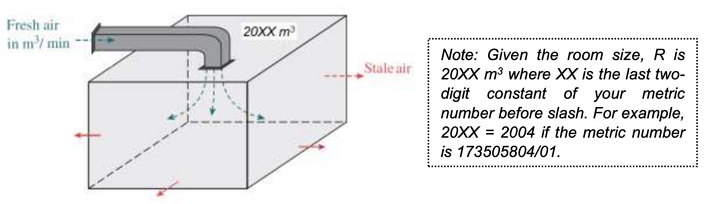

# Assignment 1

## Deadline: Week 13

---
[Question PDF]({{ site.url }}/pdf/assignment/question.pdf){: .btn .btn-purple }
[Submission](https://airtable.com/shrZ6JfJlrmrIVHRx){: .btn .btn-green }

---

Figure 1 shows the air exchange process in a room. 

It can be governed by the following equation:

$$\frac{dV}{dt} =\dot{V}_{fresh\ air} -\dot{V}_{stale\ air} =\frac{0.04}{100} F-\frac{V}{R} F\ \ \ \text{(Note: } F\ \text{and} \ R\ \text{are constants)}$$

where,

(i) $$V(t)$$ is the volume of CO$$_{2}$$ (in m$$^{3}$$) in the room at time $$t$$ (in min), i.e. $$\frac{CO_{2} \ \text{in } \%}{100} \times \text{room size} ,\ R$$.
(ii) $$\dot{V}_{fresh\ air}$$ is the input rate of fresh air that is circulated into the room at a constant F (in m$$^{3}$$/min) with 0.04% CO$$_{2}$$. Assume the stale air and fresh air mix immediately in the room.
(iii) $$\dot{V}_{stale\ air}$$ is the output rate of stale air that leave the room at a constant $$F$ m$$^{3}$$/min with CO$$_{2}$$ concentration of $$\left\{V(t) \div \text{room size}\right\}$$. 

(1) Initially, the room contains 0.30% by volume of CO$$_{2}$$. Design the required flow rate of the fresh air, $$F$$ (in m$$^{3}$$/min) if you wish to reduce the level of CO$$_{2}$$ in the room to 0.05% in 5 minutes.

 (5 marks) 

(2) Continue from (Q1), plot the table and graph for the change of level of CO$$_{2}$$ (in m$$^{3}$$) over time for 1 hour duration with 5 minutes interval by using Excel or any other software.

 (2 marks) 

(3) Continue from (Q2), estimate the steady state level of CO$$_{2}$$ (in m$$^{3}$$) within 4 significant figures and the time taken to reach the steady state level. 

 (1 mark) 

(4) Assume the room has no ventilation system initially, calculate and comment on the CO$$_{2}$$ level (in m$$^{3}$$) in the room over the time. 

 (1 mark) 

(5) 
After the installation of the ventilation system as you design in (Q1-Q3), calculate the reduction percentage (%) of the steady state CO$$_{2}$$ level (in m$$^{3}$$). If the safety level of CO$$_{2}$$ in an indoor space is less than 0.1% (or 1000 ppm) according to standard, comment if the proposed ventilation system is useful to achieve this requirement. 

 (1 mark) 

---