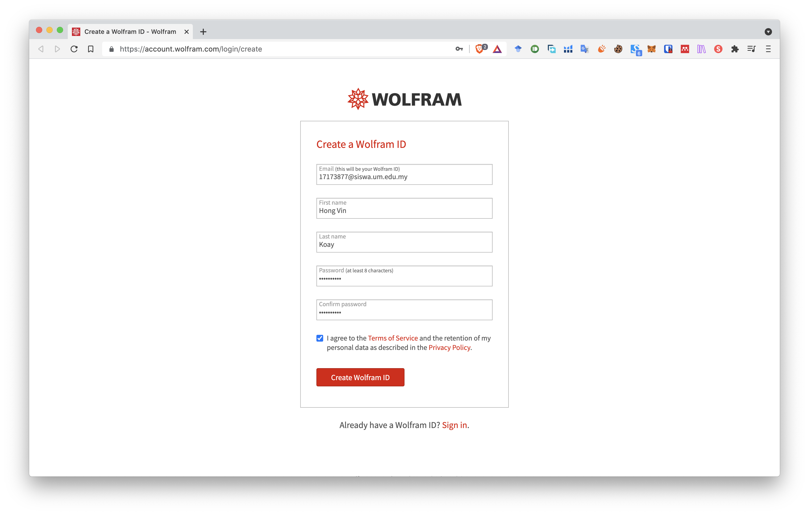
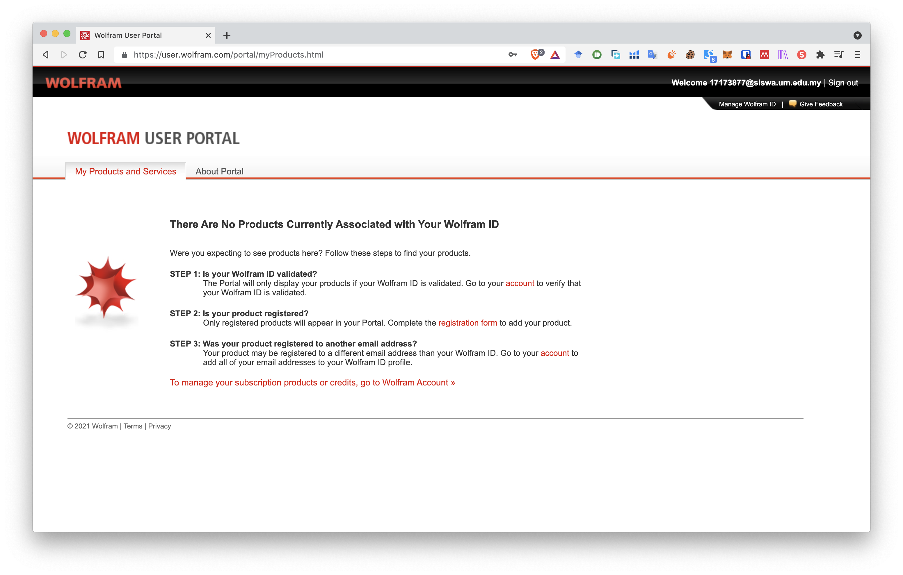
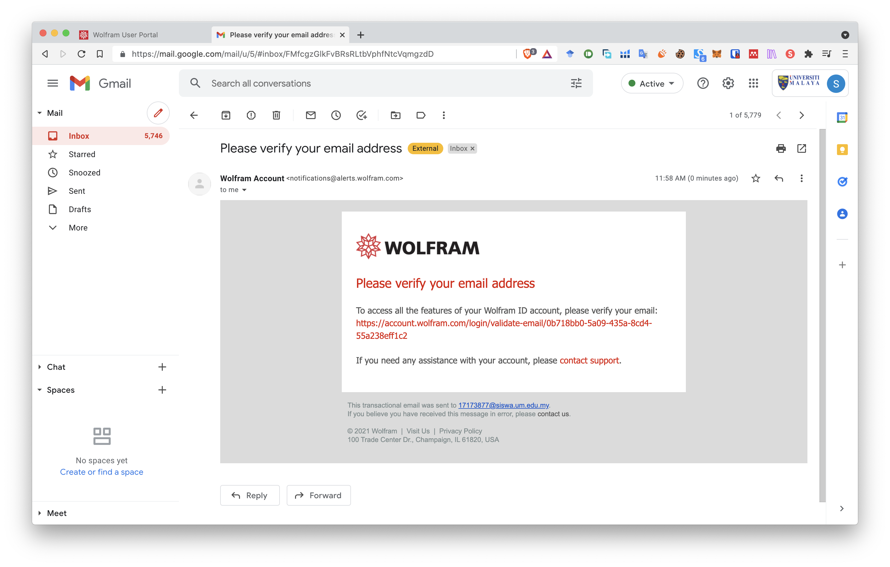
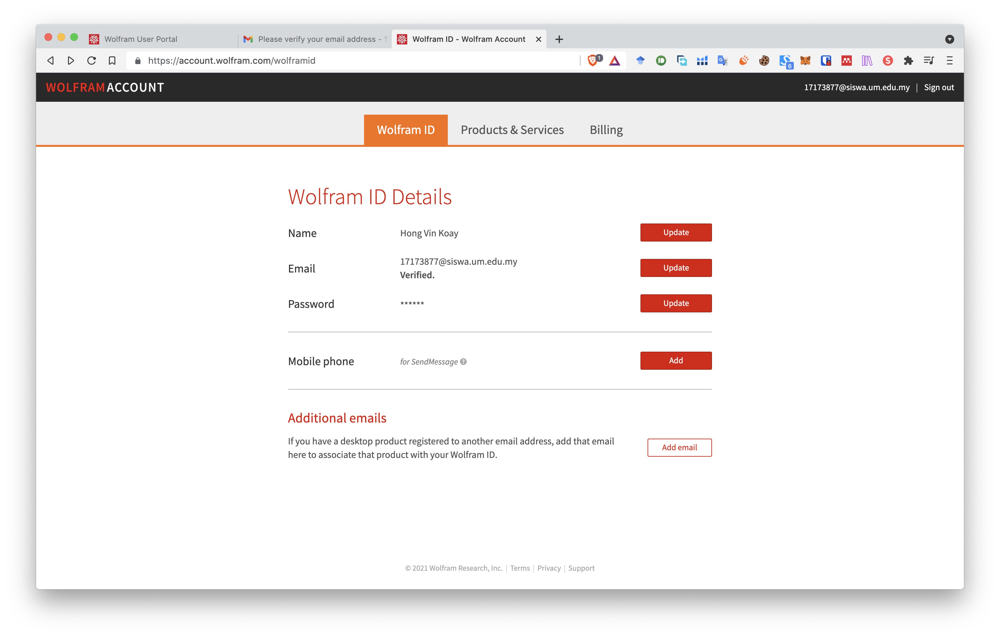
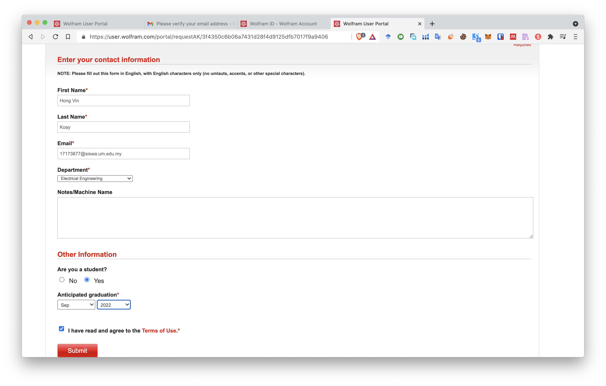
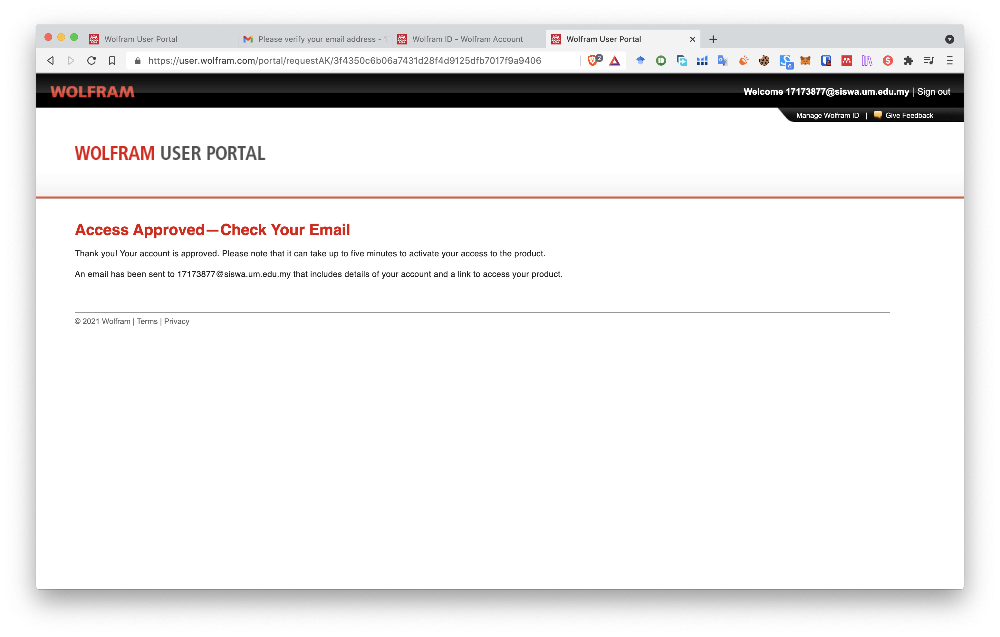
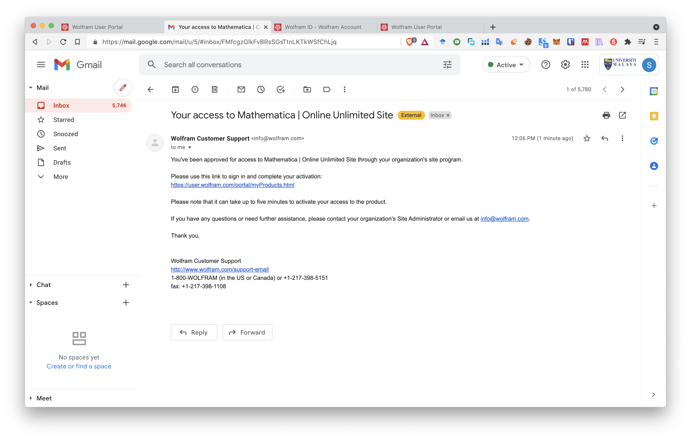
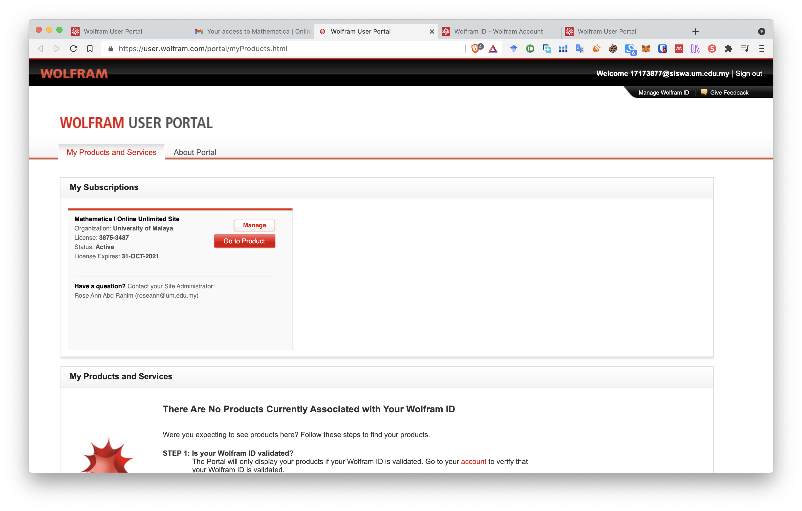
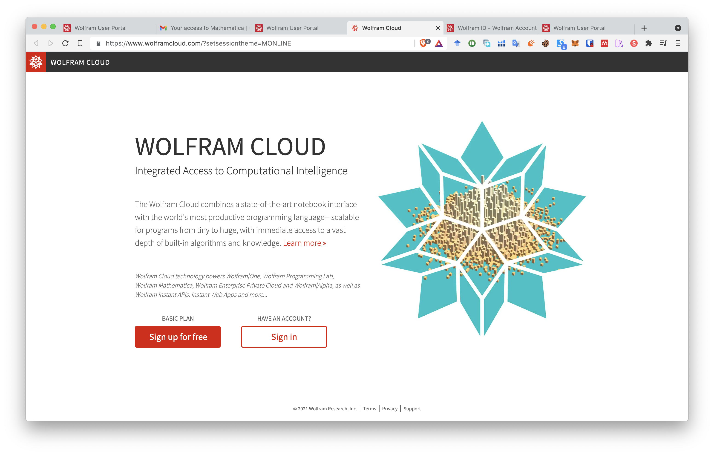
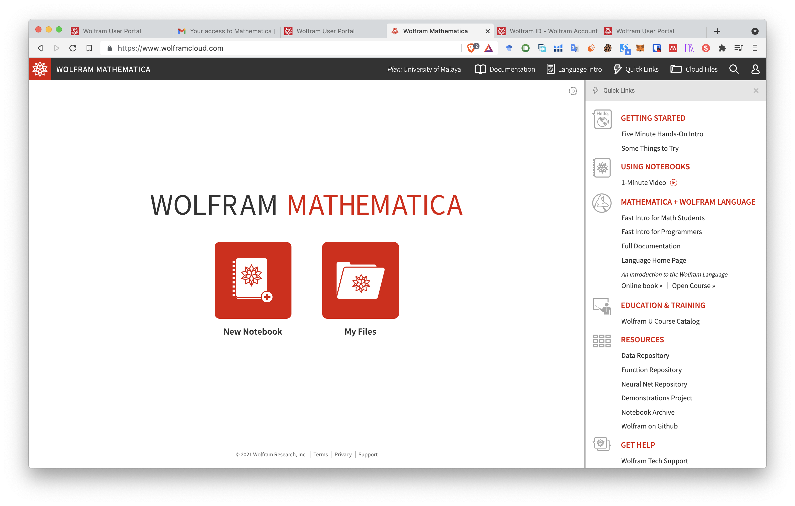

# Getting Mathematica

Get your Mathematica [here](https://oemscorp.com/wp-content/uploads/2016/11/index_UM-4.html). We will use the cloud version throughout this website. We will include the steps here.

## 1. Create an account using SiswaMail [here](https://account.wolfram.com/login/create)

Once you have register, you will see the following.

## 2. Validate your email.

After that, you will see your account validated.

## 2. Fill out the form [here](https://user.wolfram.com/portal/requestAK/3f4350c6b06a7431d28f4d9125dfb7017f9a9406)

Check your email after you getting the following page. It may takes up to five minutes.

You will receive the following email.

Click on the link and you will see the following.

Click on the **Go to Product** button.

## 3. Sign in to Mathematica Cloud using your SiswaMail.

After sign in you will see the following.

---

### Congrats! You have access to Mathematica Cloud now!

You can started to familiarise yourself with introduction over [here](https://www.wolfram.com/language/fast-introduction-for-math-students/en/entering-input/).