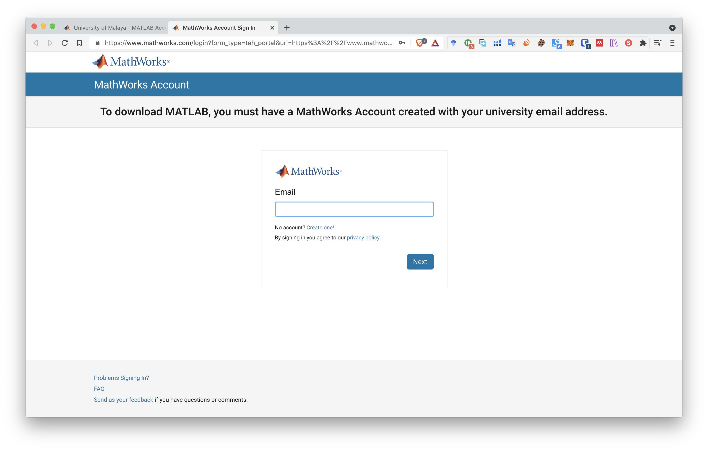
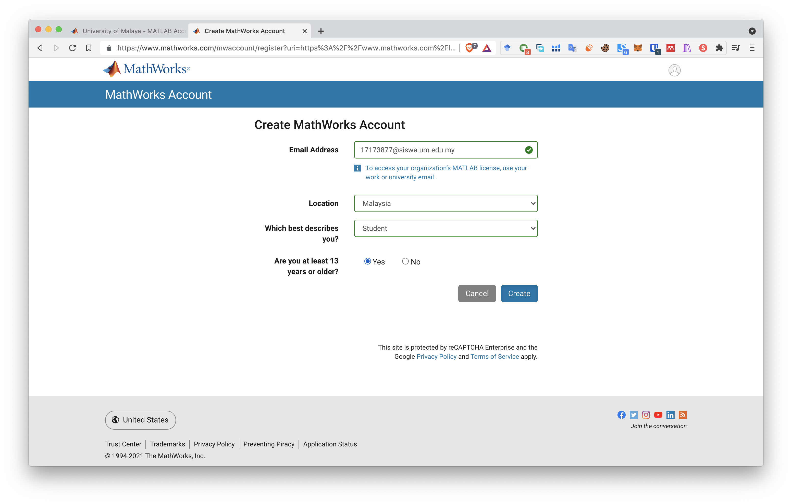
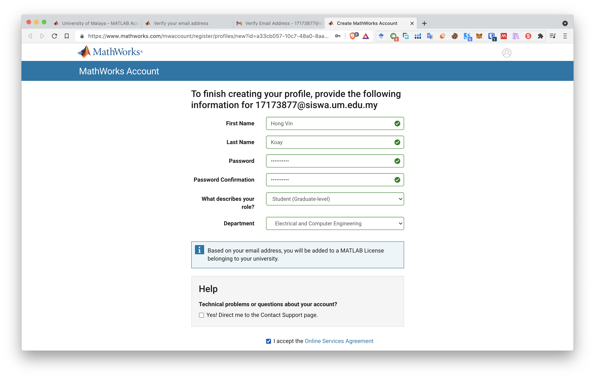
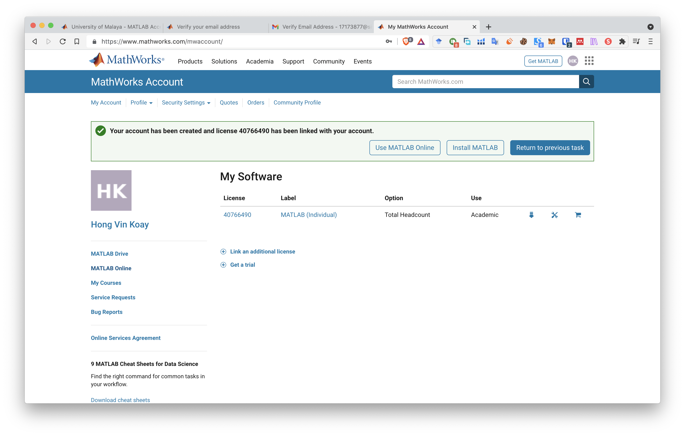
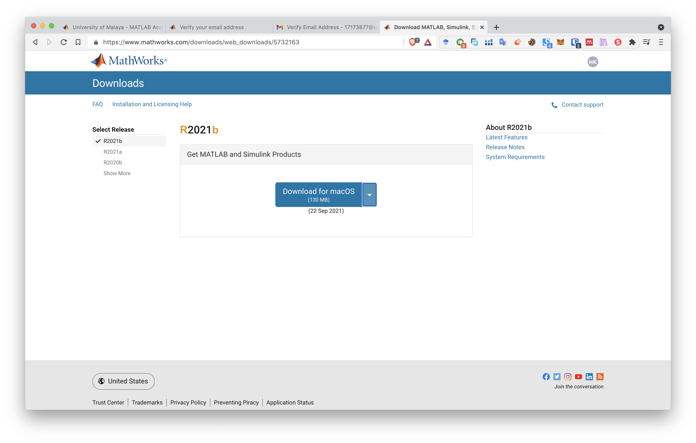
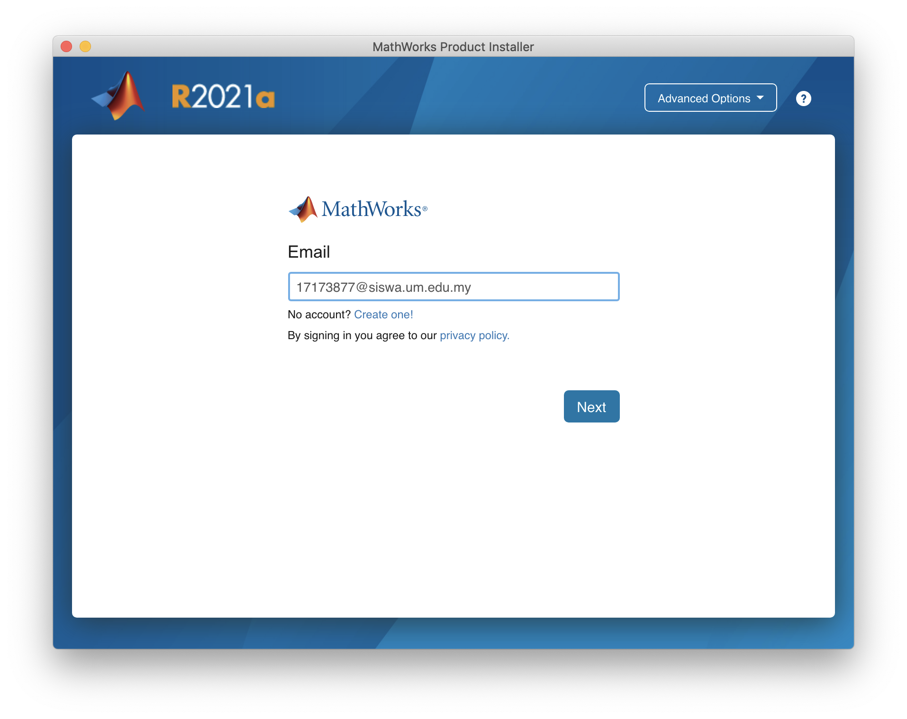
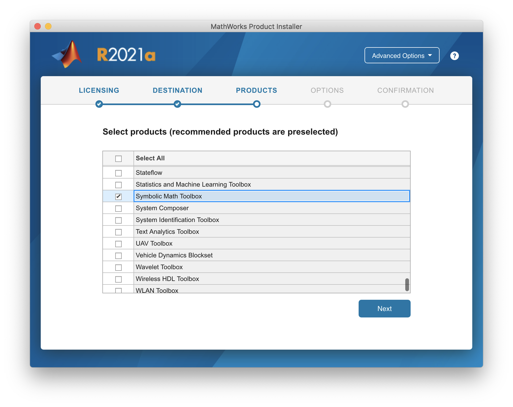
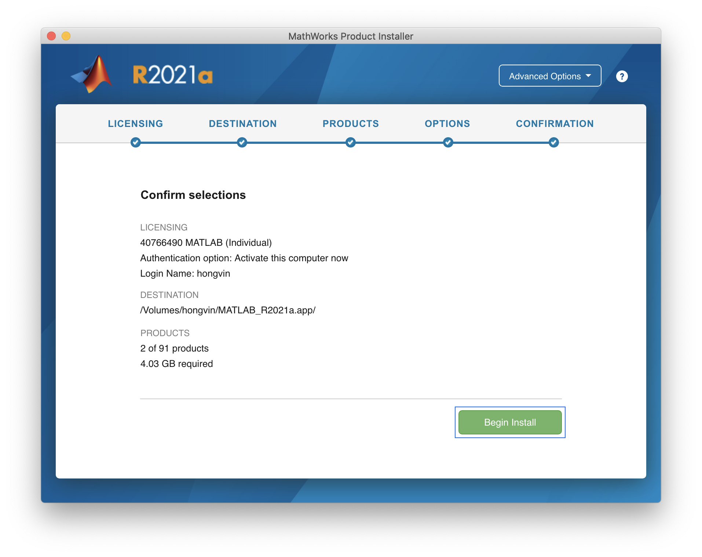
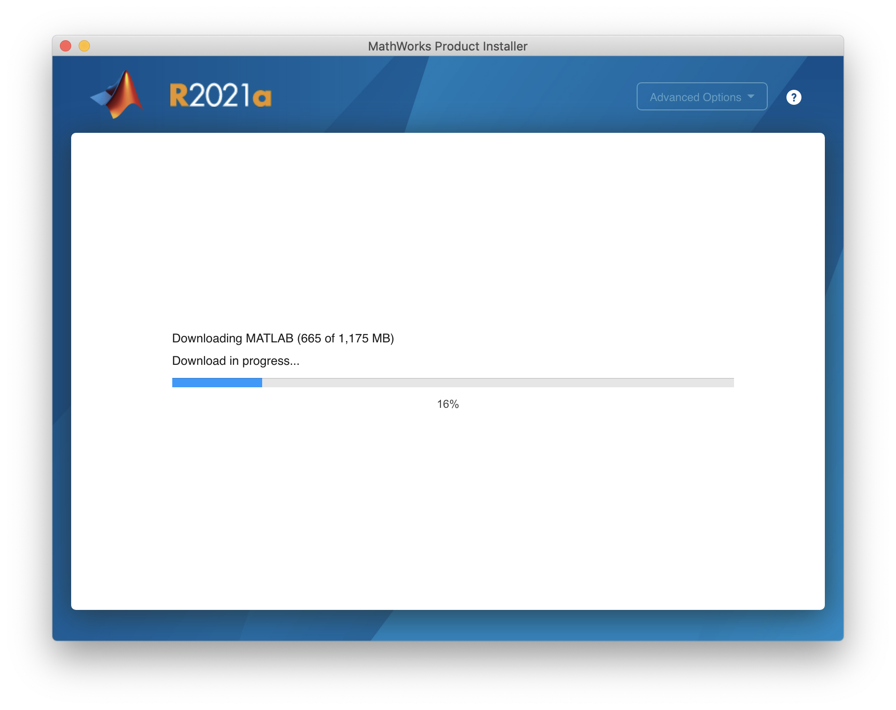

# Install your MATLAB on your PC

### 0. Check your system if it is suitable. Check the requirement page [here](https://www.mathworks.com/support/requirements/matlab-system-requirements.html).

### 1. Navigate to MATLAB for University of Malaya Page [here](https://www.mathworks.com/academia/tah-portal/university-of-malaya-31385608.html) and sign in to your account by clicking the **Sign in to get started** button.

### 2. Create your MATLAB account using your SiswaMail. If you already register, please skip to Step 6.

### 3. Create MathWork account using your SiswaMail.

### 4. Login to your SiswaMail and verify your email.

### 5. Fill in after you verify your email.

### 6. You will be navigated to My Software Page. Click on download icon next to Academic.

### 7. Download your MATLAB. (Example used here is in MacOS)

### 8. Open the installer and login using your SiswaMail

### 9. Select product to install. Suggested to select MATLAB and Symbolic Math Toolbox. You could select all if you need, but it will take up space in your PC.

### 10. Confirm all the selection and install.

### 11. Wait the installer to finish downloading and installing. Note that if you select more toolboxes, it will take longer time.

