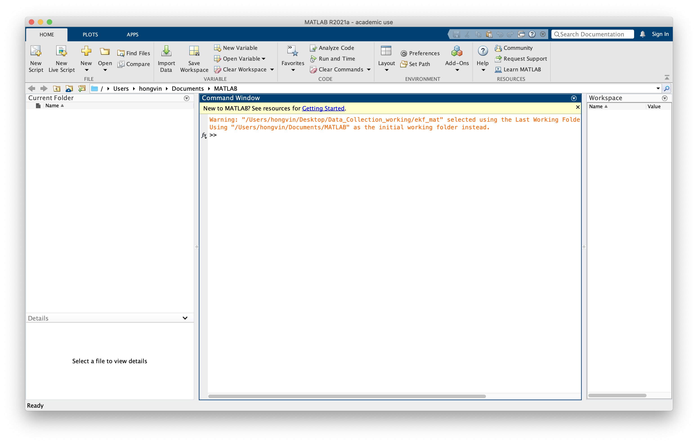
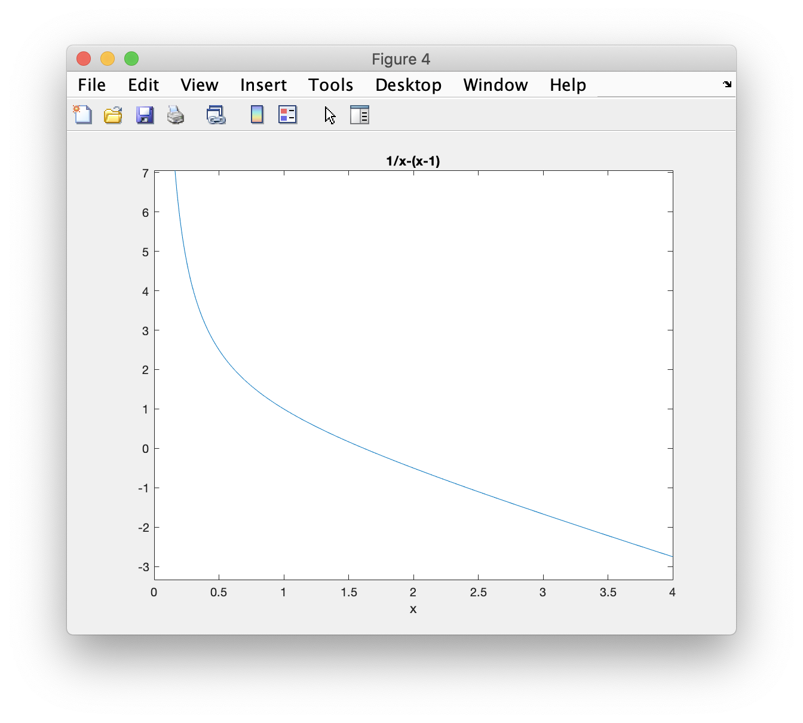

# Introduction to MATLAB

The name MATLAB stands for MATrix LABoratory. MATLAB was written originally to provide easy access to matrix software developed by the LINPACK (linear system package) and EISPACK (Eigen system package) projects.

MATLAB is a high-performance language for technical computing. It integrates computation, visualization, and programming environment. Furthermore, MATLAB is a modern programming language environment: it has sophisticated data structures, contains built-in editing and debugging tools, and supports object-oriented programming. These factors make MATLAB an excellent tool for teaching and research.

### Starting your MATLAB

When you start MATLAB, a special window called the MATLAB desktop appears. The desktop is a window that contains other windows. The major tools within or accessible from the desktop are:

- The Command Window
- The Command History
- The Workspace
- The Current Directory
- The Help Browser
- The Start button

Your MATLAB should looks like this:



### Your first command in MATLAB

Let's try to use MATLAB! Let's say we want to calculate $$\phi=\frac{1+\sqrt(2)}{2}$$. We type the following MATLAB statement into our Command Window.

```matlab
phi = (1 + sqrt(2))/2
```

The return result is:

```bash
phi =

    1.2071
```

Let's see more digits! Type in the following:

```matlab
format long
phi
```

This will produce:

```bash
phi =

   1.207106781186547
```

The statement above didn't recalculate $$\phi$$, instead, it just displayed the 16 significant digits instead of 5.

Let's try to calculate roots of polynomial. Say we have the equation $$x^2-x+1=0$$, we want the roots of the polynomial. Matlab represents a polynomial by the vector of its coefficients, in descending order. So the vector `p = [1 -1 1]` represents the polynomial of the equation. To find the roots, we use `roots` function. So the commands are:

```matlab
p = [1 -1 1]
r = roots(p)
```

This will produce:

```bash
p =

     1    -1     1


r =

  0.500000000000000 + 0.866025403784438i
  0.500000000000000 - 0.866025403784438i
```

Note that it shows both the value of `p` and `r`. To 'mute' the unwanted print of the variable `p`, simply add a `;` after the first command, as shown below.

```matlab
p = [1 -1 1];
r = roots(p)
```

Now, you will only see the answer of `p`:

```bash
r =

  0.500000000000000 + 0.866025403784438i
  0.500000000000000 - 0.866025403784438i
```

You can use the **Symbolic Toolbox**, which connects Matlab to a computer algebra system, to solve the aspect ratio equation without converting it to a polynomial. The equation involves a symbolic variable and a double equals sign. The solve function finds two solutions. Assuming our equation is $$\frac{1}{x}=x-1$$,

```matlab
syms x
r = solve(1/x == x-1)
```

This produces:

```bash
r =
 
1/2 - 5^(1/2)/2
5^(1/2)/2 + 1/2
```

The `pretty` function displays the results in a way that resembles typeset mathematics.

```matlab
pretty(r)
```

This produces:

```bash
/ 1   sqrt(5) \
| - - ------- |
| 2      2    |
|             |
| sqrt(5)   1 |
| ------- + - |
\    2      2 /
```

### Plotting graph

In Matlab, an **anonymous function** is a convenient way to define an object that can be used as an argument to other functions. The statement

```matlab
f = @(x) 1./x-(x-1)
```

defines $$f(x) = \frac{1}{x} − (x − 1)$$ and produces

```bash
f =

  function_handle with value:

    @(x)1./x-(x-1)
```

The graph of $$f(x)$$ over the interval $$0 \leq x \leq 4$$ can be obtain by:

```matlab
ezplot(f,0,4)
```



The name `ezplot` stands for “easy plot”. We tell ezplot to plot function `f` from 0 to 4 through the three parameters given.  Even though f(x) becomes infinite as $$x \rightarrow 0$$, ezplot automatically picks a reasonable vertical scale.

### Well, you are good to go! The following tutorial in MATLAB has prepared to suit you from zero to hero!

#### References

1. <https://www.mccormick.northwestern.edu/documents/students/undergraduate/introduction-to-matlab.pdf>
2. <https://www.mathworks.com/content/dam/mathworks/mathworks-dot-com/moler/intro.pdf>