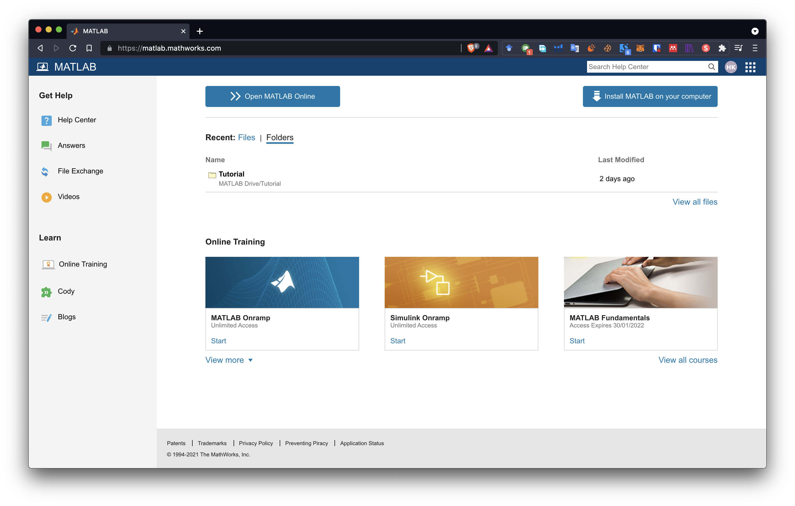
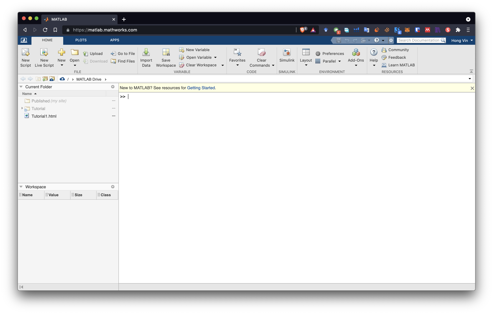

# MATLAB Online

Instead of installing MATLAB on your local PC, you can opt to use MATLAB Online. 

## Before Using MATLAB Online

Please make sure you have a valid MathWorks Account. Follow the Steps 1 to 6 [here]({{ site.url }}/intro_matlab)

## Sign in to MATLAB Online

### 1. Navigate to [MATLAB Online](https://matlab.mathworks.com/) and sign in

### 2. Sign in and you will be presented with the following screen.

### 3. Selecting "Open MATLAB Online" and you will see the MATLAB Web version! 

