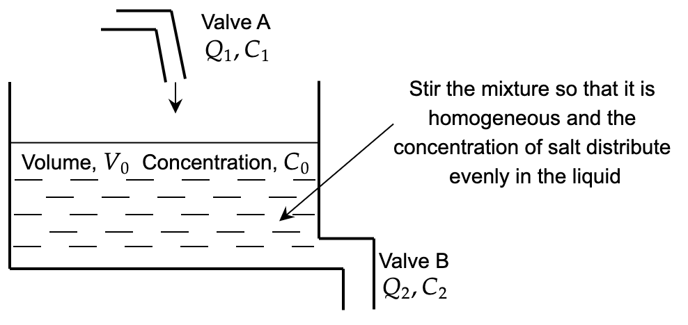
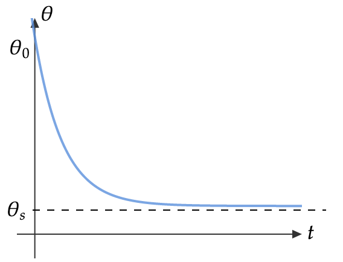

# Tutorial 11: Differential Equations (First Order)

---
[Tutorial PDF]({{ site.url }}/pdf/tutorial/tutorial11.pdf){: .btn .btn-purple }
[Solution PDF]({{ site.url }}/pdf/solution/tutorial11.pdf){: .btn .btn-green }

[Class Recording](https://drive.google.com/file/d/1hFCJDnMwQNUZcLGIdX2Zw04B73Kfg8su/view?usp=sharing){: .btn .btn-outline }

---

## Q1: Identify 5 physical laws / theory that are frequently used in your field of study (i.e. Mechanical / Electrical / Chemical / Civil / Environment / etc.) and show that they can be transformed into the form of differential equation.

---
### Sample Answer

| **Field** | **Mechanical Engineering** |
| :-------: |:---------------------------|
| Thermodynamic | Fourier’s heat equation, $$q=-k'\frac{dT}{dx}$$ where $$k'$$ is the thermal conductivity, $$\frac{dT}{dx}$$ is the change of temperature in direction $$x$$ and $$q$$ is the rate of flow of heat energy/heat flux. |
| Fluid Mechanics | Law of conservation of mass, $$\frac{dV}{dt} =0$$, where the total volumetric flow of water enter and leaving the tank during duration $$dt$$ is equal, i.e $$A_{1} v_{1} =A_{2} v_{2}$$.
| Applied Mechanics Field | Newton’s 2nd law of motion, $$\frac{dv( t)}{dt} =\frac{\sum F( t)}{m}$$ |
| Vibration Field | Mass-damper-spring system: Equations of motion, $$m\frac{d^{2} x}{dt^{2}} +c\frac{dx}{dt} +kx=0$$ |
| Mechanics of Materials Field | Differential equation for the elastic curve, $$EI\frac{d^{2} y}{dx^{2}} =-P\frac{a}{L} x$$ |

---

## Q2: Identify the dependent & independent variables for each case. Classify each equation according to its order, linearity/non-linearity, and homogeneity/non-homogeneity. Hence, find its’ solutions if it can be solved by using linear differential equation and separable differential equation.

## (i) $$5x\frac{d^{2} y}{dx^{2}} -\frac{4}{x}\frac{dy}{dx} -\sin 2x=0,\quad y( 0) =0,\quad y'( 0) =0$$

---
### Solution

- Dependent variable: $$y$$        
- Independent variable: $$x$$

2nd order linear nonhomogeneous ordinary differential equation. Initial conditions are provided.

---

## (ii) $$x^{2}\frac{d^{2} y}{dx^{2}} -3x\frac{dy}{dx} =4y,\quad y( 0) =0,\quad y( 2) =0$$

---
### Solution

Dependent variable: $$y$$        Independent variable: $$x$$

2nd order linear homogeneous ordinary differential equation. Boundary conditions are provided

---

## (iii) $$\frac{dy}{dx} +\frac{4}{x} y-x^{3} y^{2} =0,\quad y( 2) =-1$$

---
### Solution

- Dependent variable: $$y$$        
- Independent variable: $$x$$

It is 1st order nonlinear ordinary differential equation

To check the homogeneity for 1st order nonlinear differential equation, we rearrange it to the $$\frac{dy}{dx} =\frac{f( x,y)}{g( x,y)}$$ form, where $$\frac{dy}{dx} =\frac{x^{4} y^{2} -4y}{x}$$.

$$\frac{f( \lambda x,\lambda y)}{g( \lambda x,\lambda y)} =\frac{( \lambda x)^{4}( \lambda y)^{2} -4( \lambda y)}{\lambda x} =\frac{\lambda ^{6} x^{4} y^{2} -4( \lambda y)}{\lambda x}$$

Since $$f( x,y)$$ and $$g( x,y)$$ are nonhomogenous equations of various degree, therefore it is a nonhomogeneous equation.

Nonhomogeneous $$\frac{dy}{dx} =\frac{f( x,y)}{g( x,y)}$$ method is not covered in this study. Check if other analytical approach is possible to solve the problem instead of using nonhomogeneous $$\frac{dy}{dx} =\frac{f( x,y)}{g( x,y)}$$ because there is at least one approach to solve a particular ODE.

| **Exact Differential Equation** | **Linear Differential Equation** | **Separable Differential Equation** | **Bernoulli Differential Equation** |
| :---: | :---: | :---: | :---: |
| Not suitable because can’t find any formula that produce the derivate directly. To check there is exact solution or not use $$\frac{\partial M( x,y)}{\partial y} =\frac{\partial N( x,y)}{\partial x}$$ | Not suitable for non-linear ODE | Not possible because it is not separable | Possible. $$\frac{dy}{dx} +\underbrace{\frac{4}{x} y}_{p( x)} =\underbrace{x^{3}}_{r( x)}\underbrace{y^{2}}_{y^{n}}$$ |

Using Bernoulli Differential Equation:

$$\frac{dy}{dx} +\frac{4}{x} y=x^{3} y^{2}$$

**Step 1:** Divide by $$y^{n}$$, where $$n=2$$

$$y^{-2}\frac{dy}{dx} +\frac{4}{x} y^{-1} =x^{3}$$

**Step 2:** Substitution method

Let $$v=y^{-1}\qquad\frac{dv}{dx} =-y^{-2}\frac{dy}{dx}$$,

$$\begin{aligned}
-\frac{dv}{dx} +\frac{4}{x} v & =x^{3}\\
\frac{dv}{dx} -\frac{4}{x} v & =-x^{3}
\end{aligned}$$

**Step 3:** Linear Differential equation

<u><b>3.1</b> Linear Form</u> 

$$\begin{aligned}
\frac{dv}{dx} -\frac{4}{x} v & =-x^{3}
\end{aligned}$$

where $$p( x) =-\frac{4}{x} ,\quad q( x) =-x^{3}$$

<u><b>3.2</b> Integrating Factor (IF)</u>

$$IF=e^{\int p( x) \ dx} =e^{\int -\frac{4}{x} dx} =e^{-4\ln x} =x^{-4}$$

<u><b>3.3</b> Multiply</u>

$$x^{-4}\frac{dv}{dx} -x^{-4}\frac{4}{x} v=-x^{-1}$$

<u><b>3.4</b> Exact</u>

$$\frac{d}{dx}\left( x^{-4} v\right) =-x^{-1}$$

<u><b>3.5</b> Integrate</u>

$$\begin{aligned}
\int \frac{d}{dx}\left( x^{-4} v\right) dx & =\int -x^{-1} dx\\
x^{-4} v & =-\ln| x| +C\\
v & =-x^{4}\ln| x| +Cx^{4}
\end{aligned}$$

**Step 4:** Back substitution

$$\begin{aligned}
v & =-x^{4}\ln| x| +Cx^{4}\\
y^{-1} & =x^{4}( C-\ln| x| )
\end{aligned}$$

Given $$y( 2) =-1$$, 

$$\begin{aligned}
( -1)^{-1} & =( 2)^{4}( C-\ln| 2| )\\
C & =\ln| 2| -\frac{1}{16}
\end{aligned}$$

Thus,

$$\begin{aligned}
y^{-1} & =x^{4}\left(\ln| 2| -\frac{1}{16} -\ln| x| \right)\\
y & =\frac{1}{x^{4}\left(\ln| 2| -\frac{1}{16} -\ln| x| \right)}\\
 & =-\frac{16}{x^{4}( 16\ln| 2| +1+16\ln| x| )}\\
 & =\mathbf{-\frac{16}{x^{4}\left( 1+16\ln\left| \frac{x}{2}\right| \right)}}
\end{aligned}$$

---

## (iv) $$e^{-t^{3}}\frac{dx}{dt} -3t^{2} e{^{-t}}^{3} x=0,\quad x( 1) =2$$

---
### Solution

- Dependent variable: $$x$$	    
- Independent variable: $$t$$

It is 1st order linear homogeneous ordinary differential equation

| **Exact Differential Equation** | **Linear Differential Equation** | **Separable Differential Equation** | **Bernoulli Differential Equation** |
| :---: | :---: | :---: | :---: |
|Suitable. Recall product rule $$\frac{d( xy)}{dx} =x\frac{dy}{dx} +y\frac{dx}{dx}$$ | Suitable as it is linear ODE | Possible because it is separable. | Not possible. For nonlinear only |

Using Seperable Differential Equation:

$$\begin{aligned}
\int \frac{dx}{x} & =\int 3t^{2} \ dt\\
\ln\vert x\vert  & =t^{3} +C
\end{aligned}$$

Given $$x( 1) =2\Longrightarrow \ln\vert 2\vert =1^{3} +C\Longrightarrow C=\ln\vert 2\vert -1$$

$$\begin{aligned}
\ln\vert x\vert  & =t^{3} +\ln\vert 2\vert -1\\
x & =e^{\left( t^{3} +\ln\vert 2\vert -1\right)}\\
\mathbf{x} & \mathbf{=0.736e^{t^{3}}}
\end{aligned}$$

Using Exact Differential Equation:

Let $$M( t,x) =e^{-t^{3}} \ \Longrightarrow \ \frac{\delta M( t,x)}{\delta t} =-3t^{2} e^{-t^{3}}$$

$$N( t,x) =-3t^{2} e^{-t^{3}} x\Longrightarrow \frac{\delta N( t,x)}{\delta t} =-3t^{2} e^{-t^{3}}$$

Therefore there is an exact solution since $$\frac{\partial M( t,x)}{\partial t} =\frac{\partial N( t,x)}{\partial t}$$.

Recall product rule $$\frac{d( tx)}{dt} =t\frac{dx}{dt} +x\frac{dt}{dt}$$,

$$\begin{aligned}
\frac{d}{dt}\left( xe^{-t^{3}}\right) & =0\\
\delta \frac{d}{dt}\left( xe^{-t^{3}}\right) \ dt & =\delta 0\ dt\\
xe^{-t^{3}} & =C\\
x & =Ce^{t^{3}}
\end{aligned}$$

Given $$x( 1) =2\Longrightarrow xe^{-t^{3}} =C \Longrightarrow C=2e^{1^{3}} =0.736$$. Therefore, $$\mathbf{x=0.736e^{t^{3}}}$$

Using Linear Differential Equation:

**Step 1:** Arrange the differential equation in the linear form of $$\frac{dx}{dt} -p( t) x=q( t)$$.

$$e^{-t^{3}}\frac{dx}{dt} -3t^{2} e{^{-t}}^{3} x=0\ \Longrightarrow \ \frac{dx}{dt} -3t^{2} x=0$$		where $$p( t) =-3t^{2} ,\quad q( t) =0$$

**Step 2:** Create integrating factor

$$IF=e^{\int p( t) dt} =e^{\int \left( -3t^{2}\right) dt} =e^{-t^{3}}$$

**Step 3:** Multiply 1st ODE eqn by $$IF$$

$$\begin{aligned}
IF\left(\frac{dx}{dt}\right) -IF( q( t) x) & =IF( q( t))\\
e^{-t^{3}}\frac{dx}{dt} -3t^{2} e^{-t^{3}} x & =0
\end{aligned}$$

**Step 4:** Recognize the LHS is exact solution

$$\frac{d}{dt}\left( e^{-t^{3}} x\right) =0$$

**Step 5:** Integrate both side

$$\begin{aligned}
\int \frac{d}{dt}\left( e^{-t^{3}} x\right) dt & =\int 0\ dt\\
e^{-t^{3}} x & =C\\
x & =Ce^{t^{3}}
\end{aligned}$$

Given $$x( 1) =2\Longrightarrow xe^{-t^{3}} =C \Longrightarrow C=2e^{1^{3}} =0.736$$. Therefore, $$\mathbf{x=0.736e^{t^{3}}}$$

---

## (v) $$\frac{dv}{dt} -3t^{2} v+3t^{2} =0,\quad v( 1) =2$$

---
### Solution

- Dependent variable: $$v$$	
- Independent variable: $$t$$

It is 1st order linear nonhomogeneous ordinary differential equation because $$\frac{dv}{dt} -3t^{2} v=\underbrace{-3t^{2}}_{\text{non-zero
forcing
function}}$$.

| **Exact Differential Equation** | **Linear Differential Equation** | **Separable Differential Equation** | **Bernoulli Differential Equation** |
| :---: | :---: | :---: | :---: |
| Not suitable because can’t find any formula that produce the derivate directly. To check there is exact solution or not use $$\frac{\partial M( x,y)}{\partial y} =\frac{\partial N( x,y)}{\partial x}$$ | Suitable as it is linear ODE | Possible because it is separable. | Not possible. For nonlinear only |

Using Linear Differential Equation:

**Step 1:** Arrange the differential equation in the linear form of $$\frac{dx}{dt} -p( t) x=q( t)$$.

$$\frac{dv}{dt} -3t^{2} v+3t^{2} =0\ \Longrightarrow \ \frac{dv}{dt} -3t^{2} v=-3t^{2}$$		where $$p( t) =-3t^{2} ,\quad q( t) =-3t^{2}$$

**Step 2:** Create integrating factor

$$IF=e^{\int p( t) dt} =e^{\int \left( -3t^{2}\right) dt} =e^{-t^{3}}$$

**Step 3:** Multiply 1st ODE eqn by $$IF$$

$$\begin{aligned}
IF\left(\frac{dv}{dt}\right) -IF( q( t) v) & =IF( q( t))\\
e^{-t^{3}}\frac{dv}{dt} -3t^{2} e^{-t^{3}} v & =-3t^{2} e^{-t^{3}}
\end{aligned}$$

**Step 4:** Recognize the LHS is exact solution

$$\frac{d}{dt}\left( e^{-t^{3}} v\right) =-3t^{2} e^{-t^{3}}$$

**Step 5:** Integrate both side

$$\begin{aligned}
\int \frac{d}{dt}\left( e^{-t^{3}} v\right) dt & =\int \left(\underbrace{-3t^{2}}_{f'( x)}\underbrace{e^{-t^{3}}}_{f( x)}\right) \ dt\\
e^{-t^{3}} v & =e^{-t^{3}} +C
\end{aligned}$$

Given $$v( 0) =2\Longrightarrow e^{-0^{3}}( 2) =e^{-0^{3}} +C \Longrightarrow C=1$$. 

$$\begin{aligned}
e^{-t^{3}} v & =e^{-t^{3}} +1\\
\mathbf{v} & \mathbf{=1+e^{t^{3}}}
\end{aligned}$$

---

## (vi)   $$\frac{dy}{dt} -3ty=\frac{t^{2} y^{3}}{y+1} ,\quad y( 0) =0$$

---
### Solution

- Dependent variable: $$y$$
- Independent variable: $$t$$

It is 1st order nonlinear ordinary differential equation because $$\frac{dy}{dt} -3ty=\frac{t^{2} y^{3}}{y+1}$$ because dependent variable $$y$$ exist in RHS.

| **Exact Differential Equation** | **Linear Differential Equation** | **Separable Differential Equation** | **Bernoulli Differential Equation** | **Homogeneous / Nonhomogeneous $$\frac{dy}{dx} =\frac{f( x,y)}{g( x,y)}$$** |
| :---: | :---: | :---: | :---: | :---: |
Not suitable because can’t find any formula that produce the derivate directly. To check there is exact solution or not use $$\frac{\partial M( t,x)}{\partial t} =\frac{\partial N( t,x)}{\partial x}$$ | Not suitable as it is nonlinear ODE. | Not possible because it is non-separable. | Not possible. For nonlinear only. | Suitable for nonlinear. |

Using Homogeneous/ Nonhomogeneous:

To check the homogeneity for 1st order nonlinear differential equation, we rearrange it to the $$\frac{dy}{dx} =\frac{f( t,y)}{g( t,y)}$$ form, where $$\frac{dy}{dt} =\frac{t^{2} y^{3}}{y+1} +\frac{3ty^{2} +3ty}{y+1} =\frac{t^{2} y^{3} +3ty^{2} +3ty}{y+1}$$.

$$\begin{aligned}
\frac{f( \lambda t,\lambda y)}{g( \lambda t,\lambda y)} & =\frac{( \lambda t)^{2}( \lambda y)^{3} +3( \lambda t)( \lambda y)^{2} +3( \lambda t)( \lambda y)}{( \lambda y) +1}
\end{aligned}$$

Since $$f( t,y)$$ and $$g( t,y)$$ have different degree, therefore it is a nonhomogeneous equation.

Solving 1st order ODE problem by using methods other than the five methods above is out of scope of this study.

---

##  (vii) $$ x^{2}\frac{d^{2} y}{dx^{2}} -3y\frac{dy}{dx} =0,\quad y( 0) =1,\quad y( 2) =4$$

---
### Solution

- Dependent variable: $$y$$	
- Independent variable: $$x$$

2nd order nonlinear ordinary differential equation because of nonlinear component $$-3y$$. Boundary conditions are provided.

---

## (viii) $$x\frac{dy}{dx} +y=8,\quad y( 3) =5$$

---
### Solution

- Dependent variable: $$y$$	
- Independent variable: $$x$$

1st order linear nonhomogeneous ordinary differential equation, $$x\frac{dy}{dx} +y=\underbrace{8}_{\text{forcing
function}}$$.

We should recognize the LHS easily where it is an exact equation where $$\frac{d}{dx}( xy) =x\frac{dy}{dx} +y$$ and  it can be solved easily. Let us assume we do not know it is an exact equation & try with other.

Using Linear Differential Equation:

**Step 1:** Arrange the differential equation in the linear form of $$\frac{dy}{dx} -p( x) y=q( x)$$.

$$x\frac{dy}{dx} +y=8\ \Longrightarrow \ \frac{dy}{dx} +\frac{y}{x} =\frac{8}{x}$$		where $$p( t) =\frac{1}{x} ,\quad q( t) =\frac{8}{x}$$

**Step 2:** Create integrating factor

$$IF=e^{\int p( t) dt} =e^{\int \left(\frac{1}{x}\right) dt} =e^{\ln x} =x$$

**Step 3:** Multiply 1st ODE eqn by $$IF$

$$\begin{aligned}
IF\left(\frac{dy}{dx}\right) -IF( q( t) v) & =IF( q( t))\\
x\frac{dy}{dx} +y & =8
\end{aligned}$$

**Step 4:** Recognize the LHS is exact solution

$$\frac{d}{dx}( xy) =8$$

**Step 5:** Integrate both side

$$\begin{aligned}
\int \frac{d}{dx}( xy) dx & =\int ( 8) \ dx\\
xy & =8x+C\\
y & =8+\frac{C}{x}
\end{aligned}$$

Given $$y( 3) =5\Longrightarrow 5 =8+\frac{C}{3} \Longrightarrow C=-9$$. 

$$\begin{aligned}
\mathbf{y} & \mathbf{=8-\frac{9}{x}}
\end{aligned}$$

---

## (ix) $$\frac{dy}{dt} =\frac{y^{2} +yt}{t^{2}} ,\quad y( 1) =4$$

---
### Solution

- Dependent variable: $$y$	$
- Independent variable: $$t$$

1st order nonlinear ordinary differential equation $$\frac{dy}{dt} -\underbrace{\frac{y^{2} +yt}{t^{2}}}_{\text{nonlinear}} =0$$.

Using Homogeneous/ Nonhomogeneous:

To check the homogeneity for 1st order nonlinear differential equation, we rearrange it to the $$\frac{dy}{dx} =\frac{f( t,y)}{g( t,y)}$$ form, where $$\frac{dy}{dt} =\frac{y^{2} +yt}{t^{2}}$$.

$$\begin{aligned}
\frac{f( \lambda t,\lambda y)}{g( \lambda t,\lambda y)} & =\frac{( \lambda y)^{2} +( \lambda y)( \lambda t)}{( \lambda t)^{2}}
\end{aligned}$$

Since $$f( t,y)$$ and $$g( t,y)$$ are homogeneous equation with same degree, therefore it is a homogeneous equation.

Let $$v=\frac{y}{t} ,\quad y=vt,\quad \frac{dy}{dt} =t\frac{dv}{dt} +v$$

$$\begin{aligned}
-\frac{1}{v} & =\ln\vert t\vert +C\\
v & =-\frac{1}{\ln\vert t\vert +C}\\
\frac{y}{t} & =-\frac{1}{\ln\vert t\vert +C}\\
C & =-\ln\vert t\vert -\frac{t}{y}
\end{aligned}$$

Given $$y( 1) \ =\ 4$$, we get $$C =-\ln\vert t\vert -\frac{t}{y}=-\ln\vert 1\vert -\frac{1}{4} =-\frac{1}{4}$$

Rearranging,

$$\begin{aligned}
y & =-\frac{t}{\ln\vert t\vert +C}\\
\mathbf{y} & \mathbf{=-\frac{t}{\frac{1}{4} -\ln\vert t\vert }}
\end{aligned}$$

---

## (x) $$5x\frac{d^{3} y}{dx^{3}} -\frac{4}{x}\frac{dy}{dx} -5\tan x=0,\quad y( 0) =0,\quad y( 5) =4,\quad y( 10) =7$$

---
### Solution

- Dependent variable: $$y$$	
- Independent variable: $$t$$

3rd order linear nonhomogeneous ordinary differential equation where boundary conditions are provided, $$5x\frac{d^{3} y}{dx^{3}} -\frac{4}{x}\frac{dy}{dx} =\underbrace{5\tan x}_{\text{forcing
function}}$$

---

## (xi) $$x''+\sin( x) =0$$

---
### Solution

Second order ODE, non-linear because of $$\sin( x)$$.

---

## (xii) $$x''+2x'+x=\sin( t)$$

---
### Solution

Second order ODE, linear, non-homogeneous because RHS is not zero and is a function of dependent variable $$t$$.

---

## Q3: Find the solution of the differential equation $$\frac{dy}{dx} =-2x$$.

## (a)	Sketch the curves of the solution when the constant value is 1, 0 and -1, respectively.

## (b) 	What would be the particular solution if given a boundary condition of $$y( 1) \ =\ 3$$?

---
### Solution

#### <u> Question (a) </u>

$$\begin{aligned}
\frac{dy}{dx} & =-2x\\
y & =-x^{2} +C
\end{aligned}$$

#### <u> Question (b) </u>

If $$y( 1) =3,$$

$$\begin{aligned}
y & =-x^{2} +C\\
3 & =-( 1)^{2} +C\\
C & =4
\end{aligned}$$

$$\therefore y=-x^{2} +4$$

---

## Q4: (a) Given the population of rabbit in human habitat (rabbit farm) grows at a rate proportional to the number of rabbit at time $$t$$ (year). It is observed that 200 and 800 rabbits are presented at 3rd year and 6th year respectively. What was the initial number of the rabbit, $$y( 0) =y_{0}$$? How long does it take the population to double to $$2y_{0}$$?

## (b) A person has bought 1000 rabbits from the farm and releases them to the jungle that is full of predator (i.e. $$p=50$$ snakes at the time he/she releases the rabbit). Given the governing equation of the rabbit population is changed $$\frac{dy}{dt} =-p+3y\left( 1-\frac{y}{100}\right)$$. How long does it take the rabbit population to decrease to half? 

---
### Solution

#### <u> Question (a) </u>

Let $$y$$ = amount of rabbit, and $$\frac{dy( t)}{dt} =ky$$, where $$k$$ is contant.

$$\begin{aligned}
\partial \frac{dy( t)}{dt} dt & =\partial ky\ dt\\
y( t) & =\partial ky\ dt
\end{aligned}$$

Complicated and cannot be solved. Therefore, we use separable method.

$$\begin{aligned}
\frac{dy( t)}{dt} & =k\ dt & \\
\partial \frac{dy( t)}{dt} & =\partial k\ dt & \\
\ln| y|  & =kt+C & \\
y & =e^{kt+C} & \\
y & =Ae^{kt} & \text{where} \ A=e^{C}
\end{aligned}$$

Given $$y( 3) =200,\quad y( 6) =800$$,

$$200=Ae^{3k} \tag{1}$$

$$800=Ae^{6k} \tag{2}$$

Dividing (2) with (1),

$$\begin{aligned}
\frac{800}{200} & =\frac{Ae^{6k}}{Ae^{3k}}\\
4 & =e^{3k}\\
k & =\frac{\ln 4}{3} =0.462
\end{aligned}$$

From (1),	$$200=Ae^{3( 0.462)} \Longrightarrow y_{0} =A=50.015$$. Hence, $$y=Ae^{kt} =50.015e^{0.462t}$$.

At $$t=0$$, $$y_{0} =50.015e^{0.462( 0)} =50.015$$. The number of rabbit is integer, hence it is predicted that the initial number of rabbit is $$\mathbf{y_{0} =50}$$.

For $$2y_{0}$$, $$2y_{0} =y_{0} e^{0.462t} \Longrightarrow t=\frac{\ln 2}{0.462} =\mathbf{1.5\ \text{year}}$$.

#### <u> Question (b) </u>

$$\frac{dy}{dt} =-p+3y\left( 1-\frac{y}{100}\right) ,\quad t=0,\ y( 0) =1000,p=50$$

$$\begin{aligned}
\frac{dy}{dt} & =-50+3y\left( 1-\frac{y}{100}\right)\\
\frac{dy}{dt} & =-50+3y-\frac{3y^{2}}{100}\\
\frac{dy}{dt} & =\frac{-5000+300y-3y^{2}}{100}\\
\int \frac{100}{-5000+300y-3y^{2}} dy & =\int dt
\end{aligned}$$

By using partial fraction decomposition,

$$\begin{aligned}
\int \frac{-100}{3y^{2} -300y+5000} dy & =\int \left[\frac{A}{y-21.1324} +\frac{B}{3( y-78.8675)}\right] dy\\
-100 & =3A( y-78.8675) +B( y-21.1324)
\end{aligned}$$

When $$y=78.8675,$$	$$-100=B( 78.8675-21.1324) \Longrightarrow B=-1.732$$

When $$y=21.1324,$$	$$-100=3A( 21.1324-78.8675) \Longrightarrow A=0.5773$$

$$\begin{aligned}
\int \left[\frac{0.5773}{y-21.1324} +\frac{-1.732}{3( y-78.8675)}\right] dy & =\int dt\\
0.5773\ln| y-21.1324| -1.732\ln| 3( y-78.8675)|  & =C
\end{aligned}$$

Thus, $$t=0,y( 0) =1000$$,

$$\begin{aligned}
0.5773\ln| ( 1000) -21.1324| -1.732\ln| 3(( 1000) -78.8675)|  & =C\\
C & =-9.7492
\end{aligned}$$

$$\therefore 0.5773\ln| y-21.1324| -1.732\ln| 3( y-78.8675)| =-9.7492$$

This is implicit solution for the system because the solution $$y( t)$$ cannot be expressed in the explicit form, $$y=y( t)$$

---

## Q5: A brine mixing problem is illustrated in the following figure where a tank contains a liquid of $$V_{0} =10m^{3}$$ with concentration $$C_{0} =0.5\frac{g}{m^{3}}$$ initially and two valves (A & B) are opened simultaneously. The rate of change for the amount of salt in the tank over time is given: $$\frac{dx}{dt} =Q_{1} C_{1} -Q_{2}\frac{x( t)}{V_{0} +( Q_{1} +Q_{2}) t}$$. Let $$x( t)$$ = amount of salt; concentration of salt over time = $$C( t) =\frac{x( t)}{V( t)}$$; $$Q_{1} =Q_{2} =\alpha \frac{m^{3}}{min}$$; $$C_{1} =1\frac{g}{m^{3}}$$.

## Replace $$\alpha$$ with the last three digits of your matric number. For example, if your matric number is KHA110108, your $$\alpha$$ is thus 108.

## What is the change of the amount of salt and also the change of its concentration over time?

---
### Solution

Assuming $$\alpha =2$$.

$$\begin{array}
\frac{dx}{dt} =Q_{1} C_{1} -Q_{2}\frac{x( t)}{V_{0} +( Q_{q} -Q_{2}) t} ,\quad \quad V_{0} =10m^{3} ,\quad C_{0} =0.5\frac{g}{m^{3}} ,\quad \\
\quad \quad \quad \quad \quad \quad \quad \quad \quad \quad \quad \quad \quad \quad \quad \quad C_{0} =\frac{x_{0}}{V_{0}} \Longrightarrow x_{0} =C_{0} V_{0} =5g
\end{array}$$

$$\begin{aligned}
\frac{dx}{dt} & =2( 1) -2\frac{x( t)}{10+( 2-2) t}\\
 & =2-2\frac{x( t)}{10+t}\\
\frac{dx}{dt} +\frac{2}{10+t} x( t) & =2
\end{aligned}$$

Using Linear Differential Equation:

Step 1: Arrange the differential equation in the linear form of $$\frac{dy}{dx} -p( x) y=q( x)$$.

$$\frac{dx}{dt} +\frac{2}{10+t} x=2$$, where $$p( t) =\frac{2}{10+t} ,\quad q( t) =2$$

Step 2: Create integrating factor

$$IF=e^{\int p( t) dt} =e^{\int \left(\frac{2}{10+t}\right) dt} =e^{2\ln( 10+t)} =( 10+t)^{2}$$

**Step 3:** Multiply 1st ODE eqn by $$IF$$

$$\begin{aligned}
IF\left(\frac{dy}{dx}\right) -IF( q( t) v) & =IF( q( t))\\
( 10+t)^{2}\frac{dy}{dx} +2( 10+t) x & =2( 10+t)^{2}
\end{aligned}$$

**Step 4:** Recognize the LHS is exact solution

$$\frac{d}{dx}\left( x( 10+t)^{2}\right) =2( 10+t)^{2}$$

**Step 5:** Integrate both side

$$\begin{aligned}
\int \frac{d}{dt}\left( x( 10+t)^{2}\right) dt & =\int 2( 10+t)^{2} \ dt\\
x( 10+t)^{2} & =200t+20t^{2} +\frac{2}{3} t^{3} +C
\end{aligned}$$

Subtituting $$x( 0) =5$$,

$$( 5)( 10+0)^{2} =200( 0) +20( 0)^{2} +\frac{2}{3}( 0)^{3} +C\Longrightarrow C=500$$

Therefore,

Change of the amount of salt over time:

$$x( t) =\frac{1}{( 10+t)^{2}}\left( 200t+20t^{2} +\frac{2}{3} t^{3} +500\right)$$

Change of the concentration of salt over time:

$$c( t) =\frac{x( t)}{V( t)} =\frac{1}{10( 10+t)^{2}}\left( 200t+20t^{2} +\frac{2}{3} t^{3} +500\right)$$

---

## Q6: In the lecture note, mathematical modelling of engineering problem such as falling parachutist problem and electrical circuit problem, using differential equation has been demonstrated. Give an example for the mathematical modelling of an engineering problem related to your field of study by using differential equation. Identify the dependent variable, independent variable, parameters and forcing functions for your problem. You are required to present that in the tutorial class. Credit will be given for those who provide example involving calculation or illustration.

---
### Sample Answer

Assuming a bungee jumper is in mid-flight, an analytical model for the jumper’s velocity, accounting for drag, is

$$v( t) =\sqrt{\frac{gm}{c_{d}}}\tanh\left(\sqrt{\frac{gc_{d}}{m} t}\right)$$

- Dependent variable - velocity $$v$$
- Independent variables - time $$t$$
- Parameters - mass $$m$$, drag coefficient $$c_{d}$$
- Forcing function - gravitational acceleration $$g$$

---

## Q7: Given the governing equation for RLC electrical circuit: $$L\frac{d^{2} q( t)}{dt^{2}} +R\frac{dq( t)}{dt} +\frac{1}{C} q( t) =E( t)$$. An inductor of $$L\ =2$$ henrys and a resistor of $$R\ =10$$ ohms are connected in series with an emf of $$E$$ volts. Note that in this case the capacitor has been removed. At $$t\ =0$$, the switch $$S$$ is closed, thus no charge and current flow at that moment. Find the charge and current at any time $$t\  >0$$ if

## (a)	$$E( t) =40$$ volts

## (b)	$$E( t) =20e^{-3t}$$ volts

---
### Solution

\$$2\frac{d^{2} q( t)}{dt^{2}} +10\frac{dq( t)}{dt} =E( t)$$, $$q( 0) =0$$, $$i( 0) =0$$

It is a second order differential equation, however it can be reduced to first order by let,

$$\begin{gather*}
i( t) =\frac{dq( t)}{dt} ;\quad \quad \frac{di( t)}{dt} =\frac{d^{2} i( t)}{dt^{2}}\\
\\
2\frac{di( t)}{dt} +10i( t) =E( t)
\end{gather*}$$

#### <u> Question (a) </u>

$$2\frac{di( t)}{dt} +10i( t) =40 \Longrightarrow $$	It is linear differential equation that is seperable

$$\int \frac{di( t)}{20-5i( t)} =\int dt\ \Longrightarrow \ -\frac{1}{5}\ln| 20-5i| =t+C$$

Applying initial condition $$i( 0) =0$$,

$$-\frac{1}{5}\ln| 20-5( 0)| =( 0) +C\ \Longrightarrow \ C=-0.599$$

Thus, the current, $$i( t)$$:

$$\begin{gather*}
-\frac{1}{5}\ln| 20-5i| =t-0.559\ \\
\\
i( t) =\frac{20-e^{-5t+2.996}}{5} =4-\frac{1}{5} e^{-5t+2.996}\\
\mathbf{i( t) =4\left( 1-e^{-5t}\right)}
\end{gather*}$$

The charge, $$q( t)$$,

$$q( t) =\partial \ 4\left( 1-e^{-5t}\right) \ dt\ =4t+\frac{4e^{-5t}}{5} +C$$

Applying initial condition $$q( 0) =0$$,

$$\begin{gather*}
q( 0) =4( 0) +\frac{4e^{-5( 0)}}{5} +C=0\ \Longrightarrow \ C=-\frac{4}{5}\\
\mathbf{q( t) =4t+\frac{4e^{-5t}}{5} -\frac{4}{5}}
\end{gather*}$$

Note: You can get the same answer by using linear differential equation with integrating factor:

**Step 1:** Arrange the differential equation in the linear form of $$\frac{dy}{dx} -p( x) y=q( x)$$.

$$2\frac{di( t)}{dt} +10i( t) =40\ \Longrightarrow \ \frac{di( t)}{dt} +5i( t) =20$$		where $$p( t) =5,\quad q( t) =5$$

**Step 2:** Create integrating factor

$$IF=e^{\int p( t) dt} =e^{\int 5dt} =e^{5t}$$

**Step 3:** Multiply 1st ODE eqn by $$IF$$

$$\begin{aligned}
IF\left(\frac{dy}{dx}\right) -IF( q( t) v) & =IF( q( t))\\
e^{5t}\frac{di( t)}{dt} +e^{5t} 5i( t) & =20e^{5t}
\end{aligned}$$

**Step 4:** Recognize the LHS is exact solution

$$\frac{d}{dt}\left( e^{5t} i\right) =20e^{5t}$$

**Step 5:** Integrate both side

$$\begin{aligned}
\int \frac{d}{dt}\left( e^{5t} i\right) dt & =\int \left( 20e^{5t}\right) \ dt
\end{aligned}$$

For current, $$i( t)$$,

$$i( t) =\partial \left( 20e^{5t}\right) \ dt=4+Ce^{-5t}$$

Applying initial condition $$i( 0) =0$$,

$$i( 0) =4+Ce^{-5( 0)} =0\Longrightarrow C=-4$$

Thus, $$\mathbf{i(t)} = \mathbf{4\left( 1-e^{-5t}\right)}$$

Hence,

$$\begin{aligned}
q( t) & =\int \ 4\left( 1-e^{-5t}\right) dt\\
\mathbf{q( t)} & \mathbf{=4t+\frac{4e^{-5t}}{5} -\frac{4}{5}}
\end{aligned}$$

#### <u> Question (b) </u>

$$2\frac{di( t)}{dt} +10i( t) =20e^{-3t} \Longrightarrow$$	It is linear differential equation that is seperable

$$\int \frac{di( t)}{10e^{-34} -5i( t)} =\int dt$$

It is difficult to solve. Using linear differential equation with integrating factor:

**Step 1:** Arrange the differential equation in the linear form of $$\frac{dy}{dx} -p( x) y=q( x)$$.

$$2\frac{di( t)}{dt} +10i( t) =20e^{-3t} \ \Longrightarrow \ \frac{di( t)}{dt} +5i( t) =10e^{-3t}$$		where $$p( t) =5,\quad q( t) =10e^{-3t}$$

**Step 2:** Create integrating factor

$$IF=e^{\int p( t) dt} =e^{\int 5dt} =e^{5t}$$

**Step 3:** Multiply 1st ODE eqn by $$IF$

$$\begin{aligned}
IF\left(\frac{dy}{dx}\right) -IF( q( t) v) & =IF( q( t))\\
e^{5t}\frac{di( t)}{dt} +e^{5t} 5i( t) & =10e^{-3t} e^{5t}
\end{aligned}$$

**Step 4:** Recognize the LHS is exact solution

$$\frac{d}{dt}\left( e^{5t} i\right) =10e^{2t}$$

**Step 5:** Integrate both side

$$\begin{aligned}
\int \frac{d}{dt}\left( e^{5t} i\right) dt & =\int \left( 10e^{2t}\right) \ dt\\
e^{5t} i & =5e^{2t} +C
\end{aligned}$$

Applying initial condition $$i( 0) =0$$,

$$e^{5( 0)}( 0) =5e^{2( 0)} +C=0\Longrightarrow C=-5$$

Thus, $$\mathbf{i( t) =} 5e^{-3t} -5e^{-5t} =\mathbf{5\left( e^{-3t} -e^{-5t}\right)}$$.

Hence,

$$q( t) =\int 5\left( e^{-3t} -e^{-5t}\right) dt=-\frac{5}{3} e^{-3t} +e^{-5t} +C$$

Applying initial condition $$i( 0) =0$$,

$$q( 0) =-\frac{5}{3} e^{-3( 0)} +e^{-5( 0)} +C\Longrightarrow \ C=\frac{5}{3}$$

Thus, $$\mathbf{q( t) =-\frac{5}{3} e^{-3t} +e^{-5t} +\frac{5}{3}}$$

---

## Q8: When a hot liquid is placed on a cooler environment, experimental observation shows that its temperature decreases to approximately that of its surroundings. A typical graph of the temperature of the liquid plotted against time is shown in the figure below:

## After an initially rapid decrease the temperature changes progressively less rapidly and eventually the curve appears to ‘flatten out’. Newton’s law of cooling states that the rate of cooling of liquid is proportional to the difference between its temperature and the temperature of its environment (the ambient temperature). To convert this into mathematics, let $$t$$ be the time elapsed (in seconds, s), $$\theta$$ the temperature of the liquid (°C), and $$\theta _{0}$$ the temperature of the liquid at the start ($$t\ =\ 0$$). The temperature of the surroundings is denoted by $$\theta _{s}$$. The mathematical expression of Newton’s law of cooling is thus $$\frac{d\theta }{dt} \varpropto ( \theta -\theta _{s})$$, or $$\frac{d\theta }{dt} =-k( \theta -\theta _{s})$$. Here, $$k$$ is a positive constant of proportionality and the negative sign is present because $$( \theta -\theta _{s})$$ is positive, whereas $$\frac{d\theta }{dt}$$ must be negative because $$\theta$$ decreases with time. Thus, this justifies the presence of the negative sign.

## a)	What would be the unit of $$k$$?

## b)	Given the initial condition at $$t=0$$ is $$\theta =\theta _{0}$$, find the solution to the differential equation $$\frac{d\theta }{dt} =-k( \theta -\theta _{s})$$ that satisfy the initial condition.

## c) 	Plot the graph of $$\theta$$ against $$t$$ for the solution obtained in b) and indicate $$\theta _{0}$$ and $$\theta _{s}$$ on the axis.

## d) 	If the Newton’s law of cooling is written in the form of $$\frac{d\theta }{dt} +k\theta =k\theta _{s}$$, solve the differential equation using the integrating factor method. Initial condition is the same as given in b). Compare your answer with the one obtained in b).

---
### Solution

#### <u> Question (a) </u>

$$s^{-1}$$

#### <u> Question (b) </u>

Separate the variables to obtain an equation connecting two integrals,

$$\int \frac{d\theta }{\theta -\theta _{s}} =-\int k\ dt$$

Integrate both sides of the equation,

$$\ln( \theta -\theta _{s}) =-kt+C$$

Apply the initial condition and take exponentials to obtain a formula for $$\theta$$,

$$\begin{aligned}
\ln( \theta -\theta _{s}) & =-kt+C\\
\ln( \theta -\theta _{s}) & =-kt+\ln( \theta _{0} -\theta _{s})\\
\ln( \theta -\theta _{s}) -\ln( \theta _{0} -\theta _{s}) & =-kt\\
\ln\left(\frac{\theta -\theta _{s}}{\theta _{0} -\theta _{s}}\right) & =-kt\\
\frac{\theta -\theta _{s}}{\theta _{0} -\theta _{s}} & =e^{-kt}\\
\mathbf{\theta } & \mathbf{=\theta _{s} +( \theta _{0} -\theta _{s}) e^{-kt}}
\end{aligned}$$

#### <u> Question (c) </u>

The graph of $$\theta$$ against $$t$$ for $$\theta =\theta _{s} +( \theta _{0} -\theta _{s}) e^{-ki}$$,

As time increases ($$t\rightarrow \infty$$), the temperature of the object cools down to that of the environment, i.e. $$\theta \rightarrow \theta _{s}$$.

#### <u> Question (d) </u>

$$\frac{d\theta }{dt} +k\theta =k\theta _{s}$$

The integrating factor is $$e^{\int k\ dt} =e^{kt}$$,

$$e^{kt}\frac{d\theta }{dt} +ke^{kt} \theta =k\theta _{s} e^{kt}$$

Rearranging,

$$\frac{d}{dt}\left( e^{kt} \theta \right) =k\theta _{s} e^{kt}$$

Integrate this equation and apply the initial condition,

$$e^{kt} \theta =\theta _{s} e^{kt} +C$$

When $$t=0$$, $$\theta _{0} =\theta _{s} +C$$, thus $$C=\theta _{0} -\theta _{s}$$.

$$\therefore \ e^{kt} \theta =\theta _{s} e^{kt} +\theta _{0} -\theta _{s}$$

Rearranging,

$$\mathbf{\theta =\theta _{s} +( \theta _{0} -\theta _{s}) e^{-kt}}$$

Obtaining the same answer as in (b).