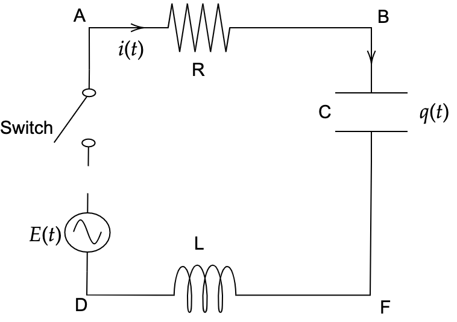
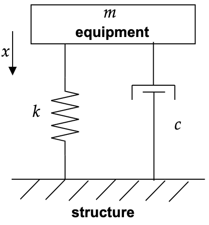
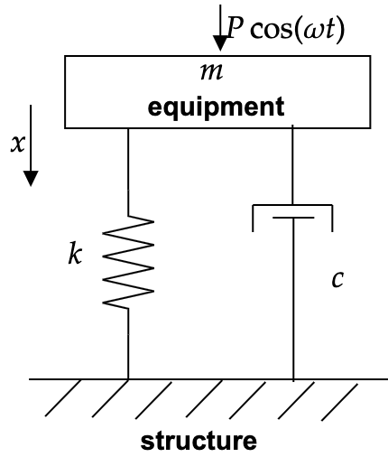

# Tutorial 12: 2nd Order Differential Equation

---
[Tutorial PDF]({{ site.url }}/pdf/tutorial/tutorial12.pdf){: .btn .btn-purple }
[Solution PDF]({{ site.url }}/pdf/solution/tutorial12.pdf){: .btn .btn-green }

[Class Recording](https://drive.google.com/file/d/1C-YDAQq_Ort5f41A8zhd8KfvhQ0_1dU2/view?usp=sharing){: .btn .btn-outline }

---

## Q1: Given the governing equation for RLC electrical circuit: $$L\frac{d^{2} q( t)}{dt^{2}} +R\frac{dq( t)}{dt} +\frac{1}{C} q( t) =E( t)$$. An inductor of $$L=50$$ henrys, a resistor of $$R=5$$ ohms and a capacitor of $$C=8$$ farads are connected in series with an emf of $$E$$ volts. At $$t=0$$, the switch $$S$$ is closed. Find the charge and current at any time $$t >0$$ if the voltage is supplied by (a) DC battery, $$E( t) =\alpha $$ volts or (b) AC generator, $$E( t) =be^{-3t}$$ volts.

## Replace $$\alpha$$ with the last three digits of your matric number. For example, if your matric number is KHA110108, your $$\alpha$$ is thus 108.

## Replace $$b$$ with the last three digits of your matric number divided by 5. For example, if your matric number is KHA110108, your $$b$$ is thus 108/5.

---
### Solution

#### <u> Question (a) </u>

Assume $$\alpha =100$$

$$50\frac{d^{2} q( t)}{dt^{2}} +5\frac{dq( t)}{dt} +\frac{1}{8} q( t) =100,\quad \quad q( 0) =0,\quad \quad i( 0) =0$$

| **Step 1:** Homogeneous Part $$50\frac{d^{2} q( t)}{dt^{2}} +5\frac{dq( t)}{dt} +\frac{1}{8} q( t) =0$$ | **Step 2:** Nonhomogeneous Part $$\begin{gather*} 50\frac{d^{2} q( t)}{dt^{2}} +5\frac{dq( t)}{dt} +\frac{1}{8} q( t) =100,\quad \\ r( t) =e^{\alpha t} P_{n}( t) =100 \end{gather*}$$ |
|:----|:----|
Characteristic equation: $$\begin{aligned} 50m^{2} +5m+\frac{1}{8} & =0\\ 400m^{2} +40m+1 & =0\\ ( 20m+1)^{2} & =0\\ m & =-\frac{1}{20} \end{aligned}$$   Comment: Repeated real root ($$m_{1} =m_{2} =-0.005$$)  Complementary solution: $$q_{c}( t) =c_{1} e^{-0.05t} +c_{2} te^{-0.005t}$$ | RHS is a polynomial function, 100 $$\alpha =0,\ n=0$$   Since $$\alpha \neq m_{1} \ \text{or} \ m_{2}$$, $$q_{p}( t) =e^{( \alpha t)} Q_{n}( t) =A$$  Thus, the total particular solution is  $$q_{p}( t) =A$$   Differentiate it gives, $$\begin{gather*} \frac{d}{dx}( q_{p}( t)) =0\\ \frac{d^{2}}{dx^{2}}( q_{p}( t)) =0 \end{gather*}$$  Then, we get  $$\begin{aligned} 50( 0) +5( 0) +\frac{1}{8} q & =100\\ \frac{1}{8} A & =100\\ A & =800 \end{aligned}$$  Actual particular solution, $$q_{p}( x) =800$$ |

The complete/general solution to $$50\frac{d^{2} q( t)}{dt^{2}} +5\frac{dq( t)}{dt} +\frac{1}{8} q( t) =100$$ is

**<u>Charge solution</u>**

$$q_{total}( t) =q_{c} +q_{p} =c_{1} e^{-0.05t} +c_{2} te^{-0.05t} +800$$

**<u>Current solution</u>**

$$\begin{aligned}
i( t) =\frac{dq_{total}}{dt} & =-0.05c_{1} e^{-0.05t} +c_{2} e^{-0.05t} +\left( e^{-0.05t}( -0.05)( c_{2} t)\right)\\
 & =c_{2} e^{-0.05t} -0.05e^{-0.05t}( c_{1} +c_{2} t)
\end{aligned}$$

Consider the initial value problem,

$$q( 0) =0\Longrightarrow q_{total}( 0) =c_{1} e^{-0.05( 0)} +c_{2}( 0) e^{-0.05( 0)} +800=0\Longrightarrow c_{1} =-800$$

$$i( 0) =0\Longrightarrow i( 0) =c_{2} e^{-0.05( 0)} -0.05e^{-0.05( 0)}( -800+c_{2}( 0)) =0\Longrightarrow c_{2} =-40$$

**<u>Actual Charge solution</u>**

$$q( t) =-800e^{-0.05t} -40te^{-0.05t} +800=\mathbf{-e^{-0.05t}( 800+40t) +800}$$

**<u>Actual Current solution</u>**

$$\begin{aligned}
i( t) & =-40e^{-0.05t} -0.05e^{-0.05t}( -800-40 t)\\
 & =e^{-0.05t}( -40-0.05( -800-40t))\\
 & =e^{-0.05t}( -40+40+2t)\\
\mathbf{i( t)} & \mathbf{=e^{-0.05t}( 2t)}
\end{aligned}$$

#### <u> Question (b) </u>

Assume $$b=20$$

$$50\frac{d^{2} q( t)}{dt^{2}} +5\frac{dq( t)}{dt} +\frac{1}{8} q( t) =20e^{-3t} ,\quad \quad q( 0) =0,\quad \quad i( 0) =0$$

| **Step 1:** Homogeneous Part $$50\frac{d^{2} q( t)}{dt^{2}} +5\frac{dq( t)}{dt} +\frac{1}{8} q( t) =0$$ | **Step 2:** Nonhomogeneous Part $$\begin{gather*} 50\frac{d^{2} q( t)}{dt^{2}} +5\frac{dq( t)}{dt} +\frac{1}{8} q( t) =20e^{-3t} ,\quad \\ r( t) =e^{\alpha t} P_{n}( t) =20e^{-3t} \end{gather*}$$ |
|:---|:---|
Characteristic equation: $$\begin{aligned} 50m^{2} +5m+\frac{1}{8} & =0\\ 400m^{2} +40m+1 & =0\\ ( 20m+1)^{2} & =0\\ m & =-\frac{1}{20} \end{aligned}$$  Comment: Repeated real root ($$m_{1} =m_{2} =-0.005$$)  Complementary solution: $$q_{c}( t) =c_{1} e^{-0.05t} +c_{2} te^{-0.005t}$$ | RHS is a exponential function, 100 $$\alpha =-3,\ n=0$$,  Since $$\alpha \neq m_{1} \ \text{or} \ m_{2}$$, $$q_{p}( t) =e^{( \alpha t)} Q_{n}( t) =Ae^{-3t}$$  Thus, the total particular solution is  $$q_{p}( t) =Ae^{-3t}$$  Differentiate it gives, $$\frac{d}{dx}( q_{p}( t)) =-3Ae^{-3t}\\ \frac{d^{2}}{dx^{2}}( q_{p}( t)) =9Ae^{-3t}$$  Then, we get $$\begin{aligned} 50\left( 9Ae^{-3t}\right) +5\left( -3Ae^{-3t}\right) +\frac{1}{8}\left( Ae^{-3t}\right) & =20e^{-3t}\\ e^{-3t}\left( 450A-15A+\frac{1}{8} A\right) & =e^{-3t}( 20)\\ A & =0.04596 \end{aligned}$$  Actual particular solution, $$q_{p}( x) =0.04596e^{-3t}$$ |

The complete/general solution to $$50\frac{d^{2} q( t)}{dt^{2}} +5\frac{dq( t)}{dt} +\frac{1}{8} q( t) =20e^{-3t}$$ is

**<u>Charge solution</u>**

$$q_{total}( t) =q_{c} +q_{p} =c_{1} e^{-0.05t} +c_{2} te^{-0.05t} +0.04596e^{-3t}$$

**<u>Current solution</u>**

$$\begin{aligned}
i( t) =\frac{dq_{total}}{dt} & =-0.05c_{1} e^{-0.05t} +c_{2} e^{-0.05t} +\left( e^{-0.05t}( -0.05)( c_{2} t)\right) +\left( -3( 0.04596) e^{-3t}\right)\\
 & =c_{2} e^{-0.05t} -0.05e^{-0.05t}( c_{1} +c_{2} t) -0.1379e^{-3t}
\end{aligned}$$

Consider the initial value problem,

$$q( 0) =0\Longrightarrow q_{total}( 0) =c_{1} e^{-0.05( 0)} +c_{2}( 0) e^{-0.05( 0)} +0.04596e^{-3( 0)} =0\Longrightarrow c_{1} =-0.04596$$

$$i( 0) =0\Longrightarrow i( 0) =c_{2} e^{-0.05( 0)} -0.05e^{-0.05( 0)}( -0.04596+c_{2}( 0)) -0.1379e^{-3( 0)} =0$$

$$\Longrightarrow c_{2} =0.1356$$

**<u>Actual Charge solution</u>**

$$\mathbf{q( t) =-0.04596e^{-0.05t} +0.1356te^{-0.05t} +0.04596e^{-3t}}$$

**<u>Actual Current solution</u>**

$$\begin{aligned}
i( t) & =0.1356 e^{-0.05t} -0.05e^{-0.05t}( -0.04596+0.1356t) -0.1379e^{-3t}\\
\mathbf{i( t)} & \mathbf{=e^{-0.05t}( 0.1379-0.00678t) -0.1379e^{-3t}}
\end{aligned}$$

---

## Q2: The vibration transmission from the effect of equipment/ machine vibration to its structure (e.g. washing machine attached to the ground or engine attached to the car structure) can be modelled as 1 DOF spring-damper-mass vibration problem. It can be categorised into two conditions as follows.

| **(a) Transient Condition (Free Vibration)** | **(b) Steady State Condition (Forced Vibration)** |
|:---|:---|
|  |  |
| Governing equation: $$m\frac{d^{2} x( t)}{dt^{2}} +c\frac{dx( t)}{dt} +kx( t) =0$$  _(machine at rest)_ $$x( 0) =x_{0} ,\ \quad \dot{x}( 0) =\dot{x}_{0}$$ | Governing equation: $$m\frac{d^{2} x( t)}{dt^{2}} +c\frac{dx( t)}{dt} +kx( t) =P \cos \omega t$$  _(machine is rotating with cyclic/harmonic force)_ $$x( 0) =x_{0} ,\ \quad \dot{x}( 0) =\dot{x}_{0}$$ |
| The homogeneous 2nd order ODE is known as characteristic equation because it represents the chactacteristic of many systems. It has the complementary solution ($$y_{c}$$). | The solution of nonhomogeneous 2nd order ODE is the summation of complementary solution ($$y_{c}$$) and particular solution ($$y_{p}$$).|

## Note: In vibration field, the characteristic eqn. determines the dynamic characteristic of the vibrating system such as the natural frequency which causes mechanical resonance phenomenon. By understanding the dynamic behaviour of the system though the formulation of ODE, engineer can design a safer and reliable structure/ machine. In electrical field, engineers utilize the electrical resonance in radio tuning application through the formulation of ODE’s characteristic eqn. The detail of these are out of the scope in this study. Students are encouraged to utilize the basic of the mathematical tool learned in this course for their future engineering application.

## Let the governing equation for a vibrating car structure:

$$2\frac{d^{2} x( t)}{dt^{2}} +7\frac{dx( t)}{dt} +8x( t) =F( t) ;\ \text{where} \ F( t) \ \text{is the forcing function and} \ x( 0) =2,\ \dot{x}( 0) =0$$

## Find the total solution for the 2nd order ODE equation if the forcing function is given as follows:

## (a)  No excitation, $$F( t) =0$$ and it is subjected to initial condition.

## (b)  Repeat the same problem in 2(a) with various combinations of damping, i.e. $$2\frac{d^{2} x( t)}{dt^{2}} +8\frac{dx( t)}{dt} +8x( t) =F( t)$$.

## (c)   Repeat the same problem in 2(a) with various combinations of damping, i.e. $$2\frac{d^{2} x( t)}{dt^{2}} +9\frac{dx( t)}{dt} +8x( t) =F( t)$$.

---
### Solution

#### <u> Question (a) </u>

**Homogeneous Part**, $$2\frac{d^{2} x( t)}{dt^{2}} +9\frac{dx( t)}{dt} +8x( t) =0;\quad x( 0) =2,\quad \dot{x}( 0) =0$$

Characteristic equation:

$$\begin{aligned}
2m^{2} +7m+8 & =0\\
m & =\frac{-7\pm \sqrt{7^{2} -4( 2)( 8)}}{2( 2)} =\frac{-7\pm \sqrt{-15}}{4} =-\frac{7}{4} \pm i\frac{\sqrt{15}}{4}
\end{aligned}$$

Comment: A pair of complex conjugates roots ($$m_{1} =-\frac{7}{4} +i\frac{\sqrt{15}}{4} ;\ m_{2} =-\frac{7}{4} -i\frac{\sqrt{15}}{4}$$)

Complementary solution: 

$$\begin{aligned}
x( t) & =c_{1} e^{\left( -\frac{7}{4} +i\right) t} +c_{2} e^{\left( -\frac{7}{4} -i\right) t} =e^{\left( -\frac{7}{4}\right) t}\left( c_{1} e^{\left( i\frac{\sqrt{15}}{4}\right) t} +c_{2} e^{\left( -i\frac{\sqrt{15}}{4}\right) t}\right)\\
 & =e^{\left( -\frac{7}{4} +i\right) t}\left( A\cos\frac{\sqrt{15}}{4} t+B\sin\frac{\sqrt{15}}{4} t\right)
\end{aligned}$$

where $$e^{\pm ix} =\cos x\pm i\sin x,\ A=c_{1} +c_{2} ,\ B=i( c_{1} -c_{2})$$

**Initial Value Problem**

$$\begin{gather*}
x( t) =c_{1} e^{\left( -\frac{7}{4} +i\frac{\sqrt{15}}{4}\right) t} +c_{2} e^{\left( -\frac{7}{4} -i\frac{\sqrt{15}}{4}\right) t}\\
\dot{x}( t) =\left( -\frac{7}{4} +i\frac{\sqrt{15}}{4}\right) c_{1} e^{\left( -\frac{7}{4} +i\frac{\sqrt{15}}{4}\right) t} +\left( -\frac{7}{4} -i\frac{\sqrt{15}}{4}\right) c_{1} e^{\left( -\frac{7}{4} -i\frac{\sqrt{15}}{4}\right) t}
\end{gather*}$$

$$x( 0) =c_{1} e^{\left( -\frac{7}{4} +i\frac{\sqrt{15}}{4}\right)( 0)} +c_{2} e^{\left( -\frac{7}{4} -i\frac{\sqrt{15}}{4}\right)( 0)} =2\Longrightarrow c_{1} +c_{2} =2 \tag{1}$$

$$\begin{gather}
\dot{x}( 0) =\left( -\frac{7}{4} +i\frac{\sqrt{15}}{4}\right) c_{1} e^{\left( -\frac{7}{4} +i\frac{\sqrt{15}}{4}\right)( 0)} +\left( -\frac{7}{4} -i\frac{\sqrt{15}}{4}\right) c_{1} e^{\left( -\frac{7}{4} -i\frac{\sqrt{15}}{4}\right)( 0)}\\
\Longrightarrow \left( -\frac{7}{4} +i\frac{\sqrt{15}}{4}\right)( 2-c_{2}) +\left( -\frac{7}{4} -i\frac{\sqrt{15}}{4}\right) c_{2} =0 \end{gather} \tag{2}$$

Solving (1) and (2) simultaneously, $$c_{1} =1-1.807i;\ c_{2} =1+1.807i$$

$$x( t) =( 1-1.807i) e^{\left( -\frac{7}{4} +i\frac{\sqrt{15}}{4}\right) t} +( 1+1.807i) e^{\left( -\frac{7}{4} -i\frac{\sqrt{15}}{4}\right) t}$$

#### <u> Question (b) </u>

**Homogeneous Part**, $$2\frac{d^{2} x( t)}{dt^{2}} +9\frac{dx( t)}{dt} +8x( t) =0;\quad x( 0) =2,\quad \dot{x}( 0) =0$$

Characteristic equation:

$$\begin{aligned}
2m^{2} +8m+8 & =0\\
m & =\frac{-8\pm \sqrt{8^{2} -4( 2)( 8)}}{2( 2)} =\frac{-8\pm \sqrt{0}}{4} =-\frac{8}{4} =-2
\end{aligned}$$

Comment: Repeated real root ($$m_{1} =m_{2} =-2$$)

Complementary solution: $$x( t) =c_{1} e^{-2t} +c_{2} te^{-2t}$$

**Initial Value Problem**

$$\begin{gather*}
x( t) =c_{1} e^{-2t} +c_{2} te^{-2t}\\
\dot{x}( t) =-2c_{1} e^{-2t} +c_{2} t( -2) e^{-2t} +e^{-2t} c_{2}
\end{gather*}$$

$$\begin{aligned}
x( 0) & =c_{1} e^{( -2)( 0)} +c_{2}( 0) e^{( -2)( 0)} =2\Longrightarrow c_{1} =2
\end{aligned}$$

$$\dot{x}( 0) =-2( 2) e^{( -2)( 0)} +c_{2}( 0)( -2) e^{( -2)( 0)} +e^{( -2)( 0)} c_{2} =0\Longrightarrow c_{2} =4$$

$$\mathbf{x( t) =2e^{-2t} +4te^{-2t}}$$

#### <u> Question (c) </u>

**Homogeneous Part**, $$2\frac{d^{2} x( t)}{dt^{2}} +9\frac{dx( t)}{dt} +8x( t) =0;\quad x( 0) =2,\quad \dot{x}( 0) =0$$

Characteristic equation:

$$\begin{aligned}
2m^{2} +9m+8 & =0\\
m & =\frac{-9\pm \sqrt{9^{2} -4( 2)( 8)}}{2( 2)} =\frac{-9\pm \sqrt{17}}{4}
\end{aligned}$$

Comment: Real and distinct root ($$m_{1} =-1.2192;\ m_{2} =-3.2808$$)

Complementary solution: $$x( t) =c_{1} e^{( -1.2192) t} +c_{2} e^{( -3.2808) t}$$

**Initial Value Problem**

$$\begin{gather*}
x( t) =c_{1} e^{( -1.2192) t} +c_{2} e^{( -3.2808) t}\\
\dot{x}( t) =-1.2192c_{1} e^{( -1.2192) t} -3.2808c_{2} e^{( -3.2808) t}
\end{gather*}$$

$$\begin{aligned}
x( 0) & =c_{1} e^{( -1.2192)( 0)} +c_{2} e^{( -3.2808)( 0)} =2\Longrightarrow c_{1} +c_{2} =2
\end{aligned}$$

$$\dot{x}( 0) =-1.2192c_{1} e^{( -1.2192)( 0)} -3.2808c_{2} e^{( -3.2808)( 0)} =0\Longrightarrow -1.2192c_{1} -3.2808c_{2} e=0$$

Solving (1) and (2) simultaneously, $$c_{1} =3.1828;\ c_{2} =-1.1828$$

$$\mathbf{x( t) =3.1828e^{( -1.2192) t} -1.1828e^{( -3.2808) t}}$$

---

## Q3: Continue the problem 2. Let the governing equation for a vibrating car structure: $$2\frac{d^{2} x( t)}{dt^{2}} +7\frac{dx( t)}{dt} +8x( t) =F( t)$$; where $$F( t)$$ is the forcing function and $$x( 0) =2,\ \dot{x}( 0) =0$$. Find the total solution for the 2nd order ODE equation if the forcing function is given as follows:

## (a) Engine excitation $$F( t) =5\cos 10t$$

## (b) Engine excitation $$F( t) =8\sin 8t$$

## (c) Engine excitation $$F( t) =e^{-10t}$$

## (d) Engine excitation $$F( t) =e^{-10t}\cos 10t$$ [Hint/Alternative: Superposition]

## (e) Engine excitation $$F( t) =5\cos 10t+e^{-10t}$$

## (f) Road excitation $$F( t) =10$$

## (g) Road excitation $$F( t) =5t^{2} +7t+9$$

## (h) Road excitation $$F( t) =6te^{t} +3t$$

## Hint: Student just need to show an example for the solution of homogenous part once and do not need to repeat the same step in other examples if it is needed. To further master the skill to solve2nd order ODE problem, students can repeat Q3(a-h) for various combinations of damping as shown in Q2(b) and Q2(c) respectively.

---
### Solution

#### <u> Question (a) </u>

| **Step 1:** Homogeneous Part $$2\frac{d^{2} x( t)}{dt^{2}} +7\frac{dx( t)}{dt} +8x( t) =0$$ | **Step 2:** Nonhomogeneous Part $$2\frac{d^{2} x( t)}{dt^{2}} +7\frac{dx( t)}{dt} +8x( t) =5\cos 10t$$, $$r( t) =e^{\alpha t} P_{n}( t) =5\cos 10t=5Re\left[ e^{i10t}\right]$$ |
|:---|:---|
| Characteristic equation: $$\begin{aligned}2m^{2} +7m+8 & =0\\m & =-\frac{-7\pm \sqrt{7^{2} -4( 2)( 8)}}{2( 2)}\\& =\frac{-7\pm \sqrt{-15}}{4}\\& =-\frac{7}{4} \pm i\frac{\sqrt{15}}{4}\end{aligned}$$  Comment: A pair of complex conjugates roots ($$m_{1} =-\frac{7}{4} +i\frac{\sqrt{15}}{4} ,\ m_{2} =-\frac{7}{4} -i\frac{\sqrt{15}}{4}$$)  Complementary solution: $$x( t) = e^{\left( -\frac{7}{4}\right) t}\left( c_{1} e^{\left( i\frac{\sqrt{15}}{4}\right) t} +c_{2} e^{\left( -i\frac{\sqrt{15}}{4}\right) t}\right)$$ | For exponential function, $$5Re\left[ e^{i10t}\right]$$, $$\alpha =10i,\ n=0$$  Since $$\alpha \neq m_{1} \ \text{or} \ m_{2}$$, Assume $$x_{p,real} =Re[ x_{p}]$$, $$x_{p}( t) =e^{( \alpha t)} Q_{n}( t) =Ae^{( 10it)}$$  Differentiate it gives,$$\begin{aligned}\frac{d}{dx}( x_{p}( t)) & =10iAe^{( 10it)}\\\frac{d^{2}}{dx^{2}}( x_{p}( t)) & =-100Ae^{( 10it)}\end{aligned}$$  Then, we get $$\begin{aligned}2\frac{d^{2} x( t)}{dt^{2}} +7\frac{dx( t)}{dt} +8x( t) & =5\cos 10t\\2\left( -100Ae^{( 10it)}\right) +7\left( 10iAe^{( 10it)}\right) +8\left( Ae^{( 10it)}\right) & =5\cos 10t\\e^{( 10it)}( -192A+70iA) & =5e^{( 10it)}\end{aligned}$$  Comparing the coefficient, $$( -192A+70iA) =5\Longrightarrow A=\frac{5}{70i-192}$$  Actual particular solution, $$\begin{aligned}x_{p}( t) & =\frac{5}{70i-192} e^{( 10it)}\\& =\frac{5}{70i-192}(\cos 10t+i\sin 10t)\frac{-70i-192}{-70i-192}\\& =\frac{( -960\cos 10t+350\sin 10t) +i( -350\cos 10t-960\sin 10t)}{41764}\end{aligned}$$  $$x_{p,real}( t) =Re[ x_{p}] =-0.02299\cos 10t+0.00838\sin 10t$$ |

The complete/general solution to $$2\frac{d^{2} x( t)}{dt^{2}} +7\frac{dx( t)}{dt} +8x( t) =5\cos 10t$$ is $$x_{total} =x_{c} +x_{p} =e^{\left( -\frac{7}{4}\right) t}\left( c_{1} e^{\left( i\frac{\sqrt{15}}{4}\right) t} +c_{2} e^{\left( -i\frac{\sqrt{15}}{4}\right) t}\right) -0.02299\cos 10t+0.00838\sin 10t$$.

**Initial Value Problem**

$$x( 0) =e^{\left( -\frac{7}{4}\right) 0}\left( c_{1} e^{\left( i\frac{\sqrt{15}}{4}\right) 0} +c_{2} e^{\left( -i\frac{\sqrt{15}}{4}\right) 0}\right) -0.02299\cos 10( 0) +0.00838\sin 10( 0) =2\Longrightarrow c_{1} +c_{2} =2.02299$$

$$\begin{aligned}
\dot{x}_{total} & =e^{\left( -\frac{7}{4}\right) t}\left( i\frac{\sqrt{15}}{4} c_{1} e^{\left( i\frac{\sqrt{15}}{4}\right) t} -i\frac{\sqrt{15}}{4} c_{2} e^{\left( -i\frac{\sqrt{15}}{4}\right) t}\right)\\
 & -\frac{7}{4} e^{\left( -\frac{7}{4}\right) t}\left( c_{1} e^{\left( i\frac{\sqrt{15}}{4}\right) t} +c_{2} e^{\left( -i\frac{\sqrt{15}}{4}\right) t}\right) +0.2299\sin 10t+0.0838\cos 10t\\
\dot{x}( 0) & =e^{\left( -\frac{7}{4}\right) 0}\left( i\frac{\sqrt{15}}{4} c_{1} e^{\left( i\frac{\sqrt{15}}{4}\right) 0} -i\frac{\sqrt{15}}{4} c_{2} e^{\left( -i\frac{\sqrt{15}}{4}\right) 0}\right)\\
 & -\frac{7}{4} e^{\left( -\frac{7}{4}\right) 0}\left( c_{1} e^{\left( i\frac{\sqrt{15}}{4}\right) 0} +c_{2} e^{\left( -i\frac{\sqrt{15}}{4}\right) 0}\right) +0.2299\sin 10( 0) +0.0838\cos 10( 0)\\
\dot{x}( 0) & \left( 2.02299i\frac{\sqrt{15}}{4} -c_{2} i\frac{2\sqrt{15}}{4}\right) -\frac{7}{4}( 2.02299) +0.838=0
\end{aligned}$$

$$c_{2} =\frac{3.4564-1.9588i}{-1.9365i} \times \frac{i}{i} =1.7849i+1.0115;\quad c_{1} =1.0115-1.7849i$$

$$\mathbf{x( t) =e^{\left( -\frac{7}{4}\right) t}\left(( 1.0115-1.7849i) e^{\left( i\frac{\sqrt{15}}{4}\right) t} +( 1.0115-1.7849i) e^{\left( i\frac{\sqrt{15}}{4}\right) t}\right) -0.02299\cos 10t+0.00838\sin 10t}$$

#### <u> Question (b) </u>

| **Step 1:** Homogeneous Part $$2\frac{d^{2} x( t)}{dt^{2}} +7\frac{dx( t)}{dt} +8x( t) =0$$ | **Step 2:** Nonhomogeneous Part $$2\frac{d^{2} x( t)}{dt^{2}} +7\frac{dx( t)}{dt} +8x( t) =8\sin 8t$$, $$r( t) =e^{\alpha t} P_{n}( t) =8\sin 8t=8Im\left[ e^{i8t}\right]$$|
|:---|:---|
| Characteristic equation: $$\begin{aligned}2m^{2} +7m+8 & =0\\m & =-\frac{-7\pm \sqrt{7^{2} -4( 2)( 8)}}{2( 2)}\\& =\frac{-7\pm \sqrt{-15}}{4}\\& =-\frac{7}{4} \pm i\frac{\sqrt{15}}{4}\end{aligned}$$  Comment: A pair of complex conjugates roots ($$m_{1} =-\frac{7}{4} +i\frac{\sqrt{15}}{4} ,\ m_{2} =-\frac{7}{4} -i\frac{\sqrt{15}}{4}$$)  Complementary solution: $$x( t) = e^{\left( -\frac{7}{4}\right) t}\left( c_{1} e^{\left( i\frac{\sqrt{15}}{4}\right) t} +c_{2} e^{\left( -i\frac{\sqrt{15}}{4}\right) t}\right)$$ | For exponential function, $$8Im\left[ e^{i8t}\right]$$, $$\alpha =8i,\ n=0$$  Since $$\alpha \neq m_{1} \ \text{or} \ m_{2}$$, Assume $$x_{p,real} =Im[ x_{p}]$$, $$x_{p}( t) =e^{( \alpha t)} Q_{n}( t) =Ae^{( 8it)}$$  Differentiate it gives, $$\begin{aligned}\frac{d}{dx}( x_{p}( t)) & =8iAe^{( 8it)}\\\frac{d^{2}}{dx^{2}}( x_{p}( t)) & =-64Ae^{( 8it)}\end{aligned}$$  Then, we get $$\begin{aligned}2\frac{d^{2} x( t)}{dt^{2}} +7\frac{dx( t)}{dt} +8x( t) & =8\sin 8t\\2\left( -64Ae^{( 8it)}\right) +7\left( 8iAe^{( 8it)}\right) +8\left( Ae^{( 8it)}\right) & =8\sin 8t\\e^{( 8it)}( 56i-120) A & =8e^{( 8it)}\end{aligned}$$  Comparing the coefficient, $$( 56i-120) A=8\Longrightarrow A=\frac{8}{56i-120}$$  Actual particular solution, $$\begin{aligned}x_{p}( t) & =\frac{8}{56i-120} e^{( 8it)}\\& =\frac{8}{56i-120}(\cos 8t+i\sin 8t)\frac{-56i-120}{-56i-120}\\& =\frac{( 448\sin 8t-960\cos 8t) +i( -448\cos 8t-960\sin 8t)}{17536}\end{aligned}$$  $$x_{p,real}( t) =Im[ x_{p}] =-\frac{7}{274}\cos 8t-\frac{15}{274}\sin 8t$$ |

The complete/general solution to $$2\frac{d^{2} x( t)}{dt^{2}} +7\frac{dx( t)}{dt} +8x( t) =8\sin 8t$$ is $$x_{total} =x_{c} +x_{p} =e^{\left( -\frac{7}{4}\right) t}\left( c_{1} e^{\left( i\frac{\sqrt{15}}{4}\right) t} +c_{2} e^{\left( -i\frac{\sqrt{15}}{4}\right) t}\right) -\frac{7}{274}\cos 8t-\frac{15}{274}\sin 8t$$

**Initial Value Problem**

$$x( 0) =e^{\left( -\frac{7}{4}\right) 0}\left( c_{1} e^{\left( i\frac{\sqrt{15}}{4}\right) 0} +c_{2} e^{\left( -i\frac{\sqrt{15}}{4}\right) 0}\right) -\frac{7}{274}\cos 8( 0) -\frac{15}{274}\sin 8( 0) =2\Longrightarrow c_{1} +c_{2} =2.0255$$

$$\begin{aligned}
\dot{x}_{total} & =e^{\left( -\frac{7}{4}\right) t}\left( i\frac{\sqrt{15}}{4} c_{1} e^{\left( i\frac{\sqrt{15}}{4}\right) t} -i\frac{\sqrt{15}}{4} c_{2} e^{\left( -i\frac{\sqrt{15}}{4}\right) t}\right)\\
 & -\frac{7}{4} e^{\left( -\frac{7}{4}\right) t}\left( c_{1} e^{\left( i\frac{\sqrt{15}}{4}\right) t} +c_{2} e^{\left( -i\frac{\sqrt{15}}{4}\right) t}\right) -\frac{56}{274}\cos 8t-\frac{90}{274}\sin 8t\\
\dot{x}( 0) & =e^{\left( -\frac{7}{4}\right) 0}\left( i\frac{\sqrt{15}}{4} c_{1} e^{\left( i\frac{\sqrt{15}}{4}\right) 0} -i\frac{\sqrt{15}}{4} c_{2} e^{\left( -i\frac{\sqrt{15}}{4}\right) 0}\right)\\
 & -\frac{7}{4} e^{\left( -\frac{7}{4}\right) 0}\left( c_{1} e^{\left( i\frac{\sqrt{15}}{4}\right) 0} +c_{2} e^{\left( -i\frac{\sqrt{15}}{4}\right) 0}\right) +\frac{56}{274}\cos 8( 0) -\frac{90}{274}\sin 8( 0) =0
\end{aligned}$$

$$c_{2} =\frac{3.9826-1.9612i}{-1.9364i} \times \frac{i}{i} =2.0567i+1.0128;\quad c_{1} =1.028-2.0567i$$

$$\mathbf{x( t) =e^{\left( -\frac{7}{4}\right) t}\left(( 1.0128-2.0567i) e^{\left( i\frac{\sqrt{15}}{4}\right) t} +( 1.0128+2.0567i) e^{\left( i\frac{\sqrt{15}}{4}\right) t}\right) -\frac{7}{274}\cos 8t-\frac{15}{274}\sin 8t}$$

#### <u> Question (c) </u>

| **Step 1:** Homogeneous Part $$2\frac{d^{2} x( t)}{dt^{2}} +7\frac{dx( t)}{dt} +8x( t) =0$$ | **Step 2:** Nonhomogeneous Part $$2\frac{d^{2} x( t)}{dt^{2}} +7\frac{dx( t)}{dt} +8x( t) =e^{-10t}$$, $$r( t) =e^{\alpha t} P_{n}( t) =e^{-10t} |
|:---|:---|
| Characteristic equation: $$\begin{aligned}2m^{2} +7m+8 & =0\\m & =-\frac{-7\pm \sqrt{7^{2} -4( 2)( 8)}}{2( 2)}\\& =\frac{-7\pm \sqrt{-15}}{4}\\& =-\frac{7}{4} \pm i\frac{\sqrt{15}}{4}\end{aligned}$$  Comment: A pair of complex conjugates roots ($$m_{1} =-\frac{7}{4} +i\frac{\sqrt{15}}{4} ,\ m_{2} =-\frac{7}{4} -i\frac{\sqrt{15}}{4}$$)  Complementary solution: $$x( t) = e^{\left( -\frac{7}{4}\right) t}\left( c_{1} e^{\left( i\frac{\sqrt{15}}{4}\right) t} +c_{2} e^{\left( -i\frac{\sqrt{15}}{4}\right) t}\right)$$ | For exponential function, $$\alpha =-10,\ n=0$$  Since $$\alpha \neq m_{1} \ \text{or} \ m_{2}$$, $$x_{p}( t) =e^{( \alpha t)} Q_{n}( t) =Ae^{( -10t)}$$  Differentiate it gives, $$\begin{aligned}\frac{d}{dx}( x_{p}( t)) & =-10Ae^{( -10t)}\\\frac{d^{2}}{dx^{2}}( x_{p}( t)) & =100Ae^{( -10t)}\end{aligned}$$  Then, we get $$\begin{aligned}2\frac{d^{2} x( t)}{dt^{2}} +7\frac{dx( t)}{dt} +8x( t) & =e^{( -10t)}\\2\left( 100Ae^{( -10t)}\right) +7\left( -10Ae^{( -10t)}\right) +8\left( Ae^{( -10t)}\right) & =e^{( -10t)}\\e^{( 8it)}( 200-70+8) A & =e^{( -10t)}\end{aligned}$$  Comparing the coefficient, $$138A=1\Longrightarrow A=\frac{1}{138}$$  Actual particular solution, $$x_{p}( t) =e^{( \alpha t)} Q_{n}( t) =\frac{1}{138} e^{( -10t)}$$ |

The complete/general solution to $$2\frac{d^{2} x( t)}{dt^{2}} +7\frac{dx( t)}{dt} +8x( t) =e^{-10t}$$ is $$x_{total} =x_{c} +x_{p} =e^{\left( -\frac{7}{4}\right) t}\left( c_{1} e^{\left( i\frac{\sqrt{15}}{4}\right) t} +c_{2} e^{\left( -i\frac{\sqrt{15}}{4}\right) t}\right) +\frac{1}{138} e^{-10t}$$

**Initial Value Problem**

$$x( 0) =e^{\left( -\frac{7}{4}\right) 0}\left( c_{1} e^{\left( i\frac{\sqrt{15}}{4}\right) 0} +c_{2} e^{\left( -i\frac{\sqrt{15}}{4}\right) 0}\right) +\frac{1}{138} e^{-10( 0)} =2\Longrightarrow c_{1} +c_{2} =1.9928$$

$$\begin{aligned}
\dot{x}_{total} & =e^{\left( -\frac{7}{4}\right) t}\left( i\frac{\sqrt{15}}{4} c_{1} e^{\left( i\frac{\sqrt{15}}{4}\right) t} -i\frac{\sqrt{15}}{4} c_{2} e^{\left( -i\frac{\sqrt{15}}{4}\right) t}\right) -\frac{7}{4} e^{\left( -\frac{7}{4}\right) t}\left( c_{1} e^{\left( i\frac{\sqrt{15}}{4}\right) t} +c_{2} e^{\left( -i\frac{\sqrt{15}}{4}\right) t}\right) -\frac{10}{138} e^{-10t}\\
\dot{x}( 0) & =e^{\left( -\frac{7}{4}\right) 0}\left( i\frac{\sqrt{15}}{4} c_{1} e^{\left( i\frac{\sqrt{15}}{4}\right) 0} -i\frac{\sqrt{15}}{4} c_{2} e^{\left( -i\frac{\sqrt{15}}{4}\right) 0}\right) -\frac{7}{4} e^{\left( -\frac{7}{4}\right) 0}\left( c_{1} e^{\left( i\frac{\sqrt{15}}{4}\right) 0} +c_{2} e^{\left( -i\frac{\sqrt{15}}{4}\right) 0}\right) -\frac{10}{138} e^{-10( 0)} =0
\end{aligned}$$

$$c_{2} =\frac{3.5599-1.9295i}{-1.9365i} \times \frac{i}{i} =1.8383i+0.9964;\quad c_{1} =0.9964-1.8383i$$

$$\mathbf{x( t) =e^{\left( -\frac{7}{4}\right) t}\left(( 0.9964-1.8383i) e^{\left( i\frac{\sqrt{15}}{4}\right) t} +( 0.9964+1.8383i) e^{\left( i\frac{\sqrt{15}}{4}\right) t}\right) +\frac{1}{138} e^{-10t}}$$

#### <u> Question (d) </u>

| **Step 1:** Homogeneous Part $$2\frac{d^{2} x( t)}{dt^{2}} +7\frac{dx( t)}{dt} +8x( t) =0$$ | **Step 2:** Nonhomogeneous Part $$\begin{array}{l}2\frac{d^{2} x( t)}{dt^{2}} +7\frac{dx( t)}{dt} +8x( t) =5e^{-10t}\cos 10t,\\\begin{aligned} r( t) & =e^{\alpha t} P_{n}( t) =5e^{-10t}\cos 10t\\ & =5e^{-10t} Re\left[ e^{i10t}\right] =Re\left[ 5e^{( -10+10i) t}\right] \end{aligned} \end{array}$$ |
|:---|:---|
| Characteristic equation: $$\begin{aligned}2m^{2} +7m+8 & =0\\m & =-\frac{-7\pm \sqrt{7^{2} -4( 2)( 8)}}{2( 2)}\\& =\frac{-7\pm \sqrt{-15}}{4}\\& =-\frac{7}{4} \pm i\frac{\sqrt{15}}{4}\end{aligned}$$  Comment: A pair of complex conjugates roots ($$m_{1} =-\frac{7}{4} +i\frac{\sqrt{15}}{4} ,\ m_{2} =-\frac{7}{4} -i\frac{\sqrt{15}}{4}$$)  Complementary solution: $$x( t) = e^{\left( -\frac{7}{4}\right) t}\left( c_{1} e^{\left( i\frac{\sqrt{15}}{4}\right) t} +c_{2} e^{\left( -i\frac{\sqrt{15}}{4}\right) t}\right)$$ | For exponential function, $$ Re\left[ 5e^{( -10+10i) t}\right]$$,   $$ \alpha =-10+10i,\ n=0$$   Since $$ \alpha \neq m_{1} \ \text{or} \ m_{2}$$,  $$\begin{aligned} x_{p}( t) & =e^{( \alpha t)} Q_{n}( t) =Ae^{( -10t)} \end{aligned}$$    Assume $$ x_{p,real} =Re[ x_{p}]$$,  $$\begin{aligned} x_{p}( t) & =e^{( \alpha t)} Q_{n}( t) =Ae^{( -10+10i) t} \end{aligned}$$  Differentiate it gives,   $$\begin{aligned} \frac{d}{dx}( x_{p}( t)) & =( -10+10i) Ae^{( -10+10i) t}\\& \\\frac{d^{2}}{dx^{2}}( x_{p}( t)) & =( -200i) Ae^{( -10+10i) t}\end{aligned}$$  Then, we get $$\begin{aligned} 2\frac{d^{2} x( t)}{dt^{2}} +7\frac{dx( t)}{dt} +8x( t) & =5e^{-10t}\cos 10t\\ 2\left(( -200i) Ae^{( -10+10i) t}\right) +7\left(( -10+10i) Ae^{( -10+10i) t}\right) +8\left( Ae^{( -10+10i) t}\right) & =5e^{( -10+10i) t}\\ e^{( -10+10i) t}( 2( -200i) +7( -10+10i) +8) A & =5e^{( -10+10i) t} \end{aligned}$$   Comparing the coefficient, $$( 2( -200i) +7( -10+10i) +8) A=5\Longrightarrow A=\frac{5}{-62-330i}$$   Actual particular solution, $$\begin{aligned} x_{p}( t) & =e^{( \alpha t)} Q_{n}( t) =\frac{5}{-62-330i} e^{( -10+10i) t}\\& =\frac{5}{-62-330i} e^{( -10) t}(\cos 10t+i\sin 10t) \times \frac{-63+330i}{-63+330i}\\& =\frac{( -1650\sin 10t-310\cos 10t) +i( 1650\cos 10t-310\sin 10t)}{112744} e^{( -10) t} \end{aligned}$$    $$x_{p,real}( t) =Re[ x_{p}] =( -0.01463\sin 10t-0.002750\cos 10t) e^{( -10) t} $$ |

The complete/general solution to $$ 2\frac{d^{2} x( t)}{dt^{2}} +7\frac{dx( t)}{dt} +8x( t) =5e^{-10t}\cos 10t$$ is $$ x_{total} =x_{c} +x_{p} =e^{\left( -\frac{7}{4}\right) t}\left( c_{1} e^{\left( i\frac{\sqrt{15}}{4}\right) t} +c_{2} e^{\left( -i\frac{\sqrt{15}}{4}\right) t}\right) +( -0.01463\sin 10t-0.002750\cos 10t) e^{( -10) t}$$

**Initial Value Problem**

$$\begin{array}
x( 0) =e^{\left( -\frac{7}{4}\right) 0}\left( c_{1} e^{\left( i\frac{\sqrt{15}}{4}\right) 0} +c_{2} e^{\left( -i\frac{\sqrt{15}}{4}\right) 0}\right) +( -0.01463\sin 10( 0) -0.002750\cos 10( 0)) e^{( -10) 0} =2\\
\Longrightarrow c_{1} +c_{2} =2.0028
\end{array}$$

$$\begin{aligned}
\dot{x}_{total} & =e^{\left( -\frac{7}{4}\right) t}\left( i\frac{\sqrt{15}}{4} c_{1} e^{\left( i\frac{\sqrt{15}}{4}\right) t} -i\frac{\sqrt{15}}{4} c_{2} e^{\left( -i\frac{\sqrt{15}}{4}\right) t}\right) -\frac{7}{4} e^{\left( -\frac{7}{4}\right) t}\left( c_{1} e^{\left( i\frac{\sqrt{15}}{4}\right) t} +c_{2} e^{\left( -i\frac{\sqrt{15}}{4}\right) t}\right)\\
 & +( -0.1463\cos 10t+0.0275\sin 10t) e^{( -10) t} +( 0.1463\sin 10t+0.0275\cos 10t) e^{( -10) t}\\
\dot{x}( 0) & =e^{\left( -\frac{7}{4}\right) 0}\left( i\frac{\sqrt{15}}{4} c_{1} e^{\left( i\frac{\sqrt{15}}{4}\right) 0} -i\frac{\sqrt{15}}{4} c_{2} e^{\left( -i\frac{\sqrt{15}}{4}\right) 0}\right) -\frac{7}{4} e^{\left( -\frac{7}{4}\right) 0}\left( c_{1} e^{\left( i\frac{\sqrt{15}}{4}\right) 0} +c_{2} e^{\left( -i\frac{\sqrt{15}}{4}\right) 0}\right)\\
 & +( -0.1463\cos 10( 0) +0.0275\sin 10( 0)) e^{( -10) 0} +( 0.1463\sin 10( 0) +0.0275\cos 10( 0)) e^{( -10) 0} =0$$

$$ c_{2} =\frac{3.6237-1.9392i}{-1.9365} \times \frac{i}{i} =1.8713+1.0014i;\quad c_{1} =3.8741-1.0014i$$

$$ \mathbf{x( t) =e^{\left( -\frac{7}{4}\right) t}\left(( 3.8741-1.0014i) e^{\left( i\frac{\sqrt{15}}{4}\right) t} +( 1.8713+1.0014i) e^{\left( i\frac{\sqrt{15}}{4}\right) t}\right) +( -0.01463\sin 10t-0.002750\cos 10t) e^{( -10) t}}$$

#### <u> Question (e) </u>

| **Step 1:** Homogeneous Part $$2\frac{d^{2} x( t)}{dt^{2}} +7\frac{dx( t)}{dt} +8x( t) =0$$ | **Step 2:** Nonhomogeneous Part $$2\frac{d\power{2}x(t)|dt\power{2}}+7\frac{dx(t)|dt}+8x(t)=5\cos{10t}+e\power{-10t}$$, $$r( t)=e^{\alpha t} P_{n}( t) =5\cos 10t+e^{-10t}$$ |
|:---|:---|
| Characteristic equation: $$\begin{aligned}2m^{2} +7m+8 & =0\\m & =-\frac{-7\pm \sqrt{7^{2} -4( 2)( 8)}}{2( 2)}\\& =\frac{-7\pm \sqrt{-15}}{4}\\& =-\frac{7}{4} \pm i\frac{\sqrt{15}}{4}\end{aligned}$$  Comment: A pair of complex conjugates roots ($$m_{1} =-\frac{7}{4} +i\frac{\sqrt{15}}{4} ,\ m_{2} =-\frac{7}{4} -i\frac{\sqrt{15}}{4}$$)  Complementary solution: $$x( t) = e^{\left( -\frac{7}{4}\right) t}\left( c_{1} e^{\left( i\frac{\sqrt{15}}{4}\right) t} +c_{2} e^{\left( -i\frac{\sqrt{15}}{4}\right) t}\right)$$ | For exponential function, $$ e^{-10t}$$,  $$ \alpha =-10,\ n=0$$  Since $$ \alpha \neq m_{1} \ \text{or} \ m_{2}$$, $$\begin{aligned}x_{p_{1}}( t) & =e^{( \alpha t)} Q_{n}( t) =Ae^{( -10t)}\end{aligned}$$  For cosine function,  $$ 5\cos 10t=Re\left[ 5e^{10it}\right]$$, $$ \alpha =10i,\ n=0$$  Since $$ \alpha \neq m_{1} \ \text{or} \ m_{2}$$, $$\begin{aligned}x_{p_{2}}( t) & =e^{( \alpha t)} Q_{n}( t) =Be^{( 10it)}\end{aligned}$$  Thus, the total particular solution is $$x_{p}( t) =Ae^{( -10t)} +Be^{( 10it)}$$  Assume $$ x_{p,real}( t) =Re[ x_{p}]$$, $$x_{p}( t) =e^{( \alpha t)} Q_{n}( t) =Ae^{( -10t)} +Be^{( 10it)}$$  Differentiate it gives, $$\begin{aligned}\frac{d}{dx}( x_{p}( t)) & =-10Ae^{( -10t)} +10iBe^{10it}\\\frac{d^{2}}{dx^{2}}( x_{p}( t)) & =100Ae^{( -10t)} -100Be^{10it}\end{aligned}$$  Then, we get $$\begin{aligned}2\frac{d^{2} x( t)}{dt^{2}} +7\frac{dx( t)}{dt} +8x( t) & =5\cos 10t+e^{-10t}\\2\left( 100Ae^{( -10t)} -100Be^{10it}\right) +7\left( -10Ae^{( -10t)} +10iBe^{10it}\right) +8\left( Ae^{( -10t)} +Be^{( 10it)}\right) & =5e^{( 10i) t} +e^{-10t}\\e^{( -10) t}( 138A) +e^{( 10it)}( 70iB-192B) & =5e^{( 10i) t} +e^{-10t}\end{aligned}$$  Comparing the coefficient, $$\begin{gather*}( 70i-192) B=5\Longrightarrow B=\frac{5}{70i-192}\\138A=1\Longrightarrow A=\frac{1}{138}\end{gather*}$$  Actual particular solution, $$\begin{aligned}x_{p}( t) & =\frac{1}{138} e^{( -10t)} +\frac{5}{70i-192} e^{( 10it)}\\& =\frac{1}{138} e^{( -10t)} +\frac{5}{70i-192}\frac{-70i-192}{-70i-192}(\cos 10t+i\sin 10t)\\& =\frac{1}{138} e^{( -10t)} +i( -0.00838\cos 10t-0.02299\sin 10t)\\& +( 0.00838\sin 10t-0.02299\cos 10t)\end{aligned}$$  $$x_{p,real}( t) =Re[ x_{p}] =\frac{1}{138} e^{( -10t)} -0.02299\cos 10t+0.00838\sin 10t$$ |

The complete/general solution to $$ 2\frac{d^{2} x( t)}{dt^{2}} +7\frac{dx( t)}{dt} +8x( t) =5\cos 10t+e^{-10t}$$ is 
$$ x_{total} =x_{c} +x_{p} =e^{\left( -\frac{7}{4}\right) t}\left( c_{1} e^{\left( i\frac{\sqrt{15}}{4}\right) t} +c_{2} e^{\left( -i\frac{\sqrt{15}}{4}\right) t}\right) +\frac{1}{138} e^{( -10t)} -0.02299\cos 10t+0.00838\sin 10t$$

**Initial Value Problem**

$$\begin{array}
x( 0) =e^{\left( -\frac{7}{4}\right) 0}\left( c_{1} e^{\left( i\frac{\sqrt{15}}{4}\right) 0} +c_{2} e^{\left( -i\frac{\sqrt{15}}{4}\right) 0}\right) +\frac{1}{138} e^{( -10) 0} -0.02299\cos 10( 0) +0.00838\sin 10( 0) =2\\
\Longrightarrow c_{1} +c_{2} =2.0157
\end{array}$$

$$\begin{aligned}
\dot{x}_{total} & =e^{\left( -\frac{7}{4}\right) t}\left( i\frac{\sqrt{15}}{4} c_{1} e^{\left( i\frac{\sqrt{15}}{4}\right) t} -i\frac{\sqrt{15}}{4} c_{2} e^{\left( -i\frac{\sqrt{15}}{4}\right) t}\right) -\frac{7}{4} e^{\left( -\frac{7}{4}\right) t}\left( c_{1} e^{\left( i\frac{\sqrt{15}}{4}\right) t} +c_{2} e^{\left( -i\frac{\sqrt{15}}{4}\right) t}\right)\\
 & -\frac{10}{138} e^{( -10t)} +0.2299\sin 10t+0.0838\cos 10t\\
\dot{x}( 0) & =e^{\left( -\frac{7}{4}\right) 0}\left( i\frac{\sqrt{15}}{4} c_{1} e^{\left( i\frac{\sqrt{15}}{4}\right) 0} -i\frac{\sqrt{15}}{4} c_{2} e^{\left( -i\frac{\sqrt{15}}{4}\right) 0}\right) -\frac{7}{4} e^{\left( -\frac{7}{4}\right) 0}\left( c_{1} e^{\left( i\frac{\sqrt{15}}{4}\right) 0} +c_{2} e^{\left( -i\frac{\sqrt{15}}{4}\right) 0}\right)\\
 & -\frac{10}{138} e^{( -10) 0} +0.2299\sin 10( 0) +0.0838\cos 10( 0) =0
\end{aligned}$$

$$ c_{2} =\frac{3.5161-1.9517i}{-1.9517i} \times \frac{i}{i} =1.0078+1.8740i ;\quad c_{1} =1.0078-1.8740i$$

$$ \mathbf{x( t) =e^{\left( -\frac{7}{4}\right) t}\left(( 1.0078-1.8740i) e^{\left( i\frac{\sqrt{15}}{4}\right) t} +( 1.0078+1.8740i) e^{\left( i\frac{\sqrt{15}}{4}\right) t}\right) +\frac{1}{138} e^{( -10t)} -0.02299\cos 10t+0.00838\sin 10t}$$

#### <u> Question (f) </u>

| **Step 1:** Homogeneous Part $$2\frac{d^{2} x( t)}{dt^{2}} +7\frac{dx( t)}{dt} +8x( t) =0$$ | **Step 2:** Nonhomogeneous Part  $$\begin{array}{l}2\frac{d^{2} x( t)}{dt^{2}} +7\frac{dx( t)}{dt} +8x( t) =10,\\r( t) =e^{\alpha t} P_{n}( t) =10\end{array}$$ |
|:---|:---|
| Characteristic equation: $$\begin{aligned}2m^{2} +7m+8 & =0\\m & =-\frac{-7\pm \sqrt{7^{2} -4( 2)( 8)}}{2( 2)}\\& =\frac{-7\pm \sqrt{-15}}{4}\\& =-\frac{7}{4} \pm i\frac{\sqrt{15}}{4}\end{aligned}$$  Comment: A pair of complex conjugates roots ($$m_{1} =-\frac{7}{4} +i\frac{\sqrt{15}}{4} ,\ m_{2} =-\frac{7}{4} -i\frac{\sqrt{15}}{4}$$)  Complementary solution: $$x( t) = e^{\left( -\frac{7}{4}\right) t}\left( c_{1} e^{\left( i\frac{\sqrt{15}}{4}\right) t} +c_{2} e^{\left( -i\frac{\sqrt{15}}{4}\right) t}\right)$$ | For polynomial function, $$ 10$$, $$ \alpha =0,\ n=0$$  Since $$ \alpha \neq m_{1} \ \text{or} \ m_{2}$$, $$x_{p} =e^{( \alpha t)} Q_{n}( t) =A$$  Differentiate it gives, $$\begin{aligned}\frac{d}{dx}( x_{p}( t)) & =0\\\frac{d^{2}}{dx^{2}}( x_{p}( t)) & =0\end{aligned}$$  Then, we get $$\begin{aligned}2\frac{d^{2} x( t)}{dt^{2}} +7\frac{dx( t)}{dt} +8x( t) & =10\\2( 0) +7( 0) +8A & =10\\A & =1.25\end{aligned}$$  Actual particular solution,$$x_{p}( t) =1.25$$ |

The complete/general solution to $$ 2\frac{d^{2} x( t)}{dt^{2}} +7\frac{dx( t)}{dt} +8x( t) =10$$ is $$ x_{total} =x_{c} +x_{p} =e^{\left( -\frac{7}{4}\right) t}\left( c_{1} e^{\left( i\frac{\sqrt{15}}{4}\right) t} +c_{2} e^{\left( -i\frac{\sqrt{15}}{4}\right) t}\right) +1.25$$

**Initial Value Problem**

$$ x( 0) =e^{\left( -\frac{7}{4}\right) 0}\left( c_{1} e^{\left( i\frac{\sqrt{15}}{4}\right) 0} +c_{2} e^{\left( -i\frac{\sqrt{15}}{4}\right) 0}\right) +1.25=2\Longrightarrow c_{1} +c_{2} =0.75$$

$$\begin{aligned}
\dot{x}_{total} & =e^{\left( -\frac{7}{4}\right) t}\left( i\frac{\sqrt{15}}{4} c_{1} e^{\left( i\frac{\sqrt{15}}{4}\right) t} -i\frac{\sqrt{15}}{4} c_{2} e^{\left( -i\frac{\sqrt{15}}{4}\right) t}\right) -\frac{7}{4} e^{\left( -\frac{7}{4}\right) t}\left( c_{1} e^{\left( i\frac{\sqrt{15}}{4}\right) t} +c_{2} e^{\left( -i\frac{\sqrt{15}}{4}\right) t}\right)\\
\dot{x}( 0) & =e^{\left( -\frac{7}{4}\right) 0}\left( i\frac{\sqrt{15}}{4} c_{1} e^{\left( i\frac{\sqrt{15}}{4}\right) 0} -i\frac{\sqrt{15}}{4} c_{2} e^{\left( -i\frac{\sqrt{15}}{4}\right) 0}\right) -\frac{7}{4} e^{\left( -\frac{7}{4}\right) 0}\left( c_{1} e^{\left( i\frac{\sqrt{15}}{4}\right) 0} +c_{2} e^{\left( -i\frac{\sqrt{15}}{4}\right) 0}\right) =0\\
\dot{x}( 0) & =\left( i\frac{\sqrt{15}}{4} c_{1} -i\frac{\sqrt{15}}{4} c_{2}\right) -\frac{7}{4}( c_{1} +c_{2}) =0
\end{aligned}$$

$$ i\frac{\sqrt{15}}{4}( 0.75-c_{2}) -i\frac{\sqrt{15}}{4} c_{2} -\frac{7}{4}( 0.75) =0\Longrightarrow c_{2} =0.3750+0.6778i;\ c_{1} =0.3750-0.6778i$$

$$ \mathbf{x( t) =e^{\left( -\frac{7}{4}\right) t}\left(( 0.3750-0.6778i) e^{\left( i\frac{\sqrt{15}}{4}\right) t} +( 0.3750+0.6778i) e^{\left( i\frac{\sqrt{15}}{4}\right) t}\right) +1.25}$$

#### <u> Question (g) </u>

| **Step 1:** Homogeneous Part $$2\frac{d^{2} x( t)}{dt^{2}} +7\frac{dx( t)}{dt} +8x( t) =0$$ | **Step 2:** Nonhomogeneous Part  $$2\frac{d^{2} x( t)}{dt^{2}} +7\frac{dx( t)}{dt} +8x( t) =5t^{2} +7t+9,$$ $$r( t) =e^{\alpha t} P_{n}( t) =5t^{2} +7t+9$$ |
|:---|:---|
| Characteristic equation: $$\begin{aligned}2m^{2} +7m+8 & =0\\m & =-\frac{-7\pm \sqrt{7^{2} -4( 2)( 8)}}{2( 2)}\\& =\frac{-7\pm \sqrt{-15}}{4}\\& =-\frac{7}{4} \pm i\frac{\sqrt{15}}{4}\end{aligned}$$  Comment: A pair of complex conjugates roots ($$m_{1} =-\frac{7}{4} +i\frac{\sqrt{15}}{4} ,\ m_{2} =-\frac{7}{4} -i\frac{\sqrt{15}}{4}$$)  Complementary solution: $$x( t) = e^{\left( -\frac{7}{4}\right) t}\left( c_{1} e^{\left( i\frac{\sqrt{15}}{4}\right) t} +c_{2} e^{\left( -i\frac{\sqrt{15}}{4}\right) t}\right)$$ |For polynomial function, $$ 5t^{2} +7t+9$$, $$ \alpha =0,\ n=2$$  Since $$ \alpha \neq m_{1} \ \text{or} \ m_{2}$$, $$x_{p} =e^{( \alpha t)} Q_{n}( t) =At^{2} +Bt+C$$  Differentiate it gives,$$ \begin{aligned}\frac{d}{dx}( x_{p}( t)) & =2At+B\\\frac{d^{2}}{dx^{2}}( x_{p}( t)) & =2A\end{aligned}$$  Then, we get $$\begin{aligned}2\frac{d^{2} x( t)}{dt^{2}} +7\frac{dx( t)}{dt} +8x( t) & =5t^{2} +7t+9\\2( 2A) +7( 2At+B) +8\left( At^{2} +Bt+C\right) & =5t^{2} +7t+9\\4A+7B+8C+14At+8Bt+8A^{2} t & =5t^{2} +7t+9\end{aligned}$$  Comparing coefficients, $$ t^{2} :\quad 8A=5\Longrightarrow A=0.625$$ $$ t:\quad 14A+8B=7\Longrightarrow 14( 0.625) +8B=7\Longrightarrow B=-0.2188$$ $$ t^{0} :\quad 4A+7B+8C=9\Longrightarrow 4( 0.625) +8) -0.2188) +8C=9\Longrightarrow C=1.0040$ Actual particular solution, $$x_{p}( t) =0.625t^{2} -0.2188B+1.0040$$ |

The complete/general solution to $$ 2\frac{d^{2} x( t)}{dt^{2}} +7\frac{dx( t)}{dt} +8x( t) =5t^{2} +7t+9$$ is $$ x_{total} =x_{c} +x_{p} =e^{\left( -\frac{7}{4}\right) t}\left( c_{1} e^{\left( i\frac{\sqrt{15}}{4}\right) t} +c_{2} e^{\left( -i\frac{\sqrt{15}}{4}\right) t}\right) +0.625t^{2} -0.2188t+1.0040$$

**Initial Value Problem**

$$ x( 0) =e^{\left( -\frac{7}{4}\right) 0}\left( c_{1} e^{\left( i\frac{\sqrt{15}}{4}\right) 0} +c_{2} e^{\left( -i\frac{\sqrt{15}}{4}\right) 0}\right) +0.625( 0)^{2} -0.2188( 0) +1.0040=2\Longrightarrow c_{1} +c_{2} =0.996$$

$$\begin{aligned}
\dot{x}_{total} & =e^{\left( -\frac{7}{4}\right) t}\left( i\frac{\sqrt{15}}{4} c_{1} e^{\left( i\frac{\sqrt{15}}{4}\right) t} -i\frac{\sqrt{15}}{4} c_{2} e^{\left( -i\frac{\sqrt{15}}{4}\right) t}\right) -\frac{7}{4} e^{\left( -\frac{7}{4}\right) t}\left( c_{1} e^{\left( i\frac{\sqrt{15}}{4}\right) t} +c_{2} e^{\left( -i\frac{\sqrt{15}}{4}\right) t}\right) +1.25t-0.2188\\
\dot{x}( 0) & =e^{\left( -\frac{7}{4}\right) 0}\left( i\frac{\sqrt{15}}{4} c_{1} e^{\left( i\frac{\sqrt{15}}{4}\right) 0} -i\frac{\sqrt{15}}{4} c_{2} e^{\left( -i\frac{\sqrt{15}}{4}\right) 0}\right) -\frac{7}{4} e^{\left( -\frac{7}{4}\right) 0}\left( c_{1} e^{\left( i\frac{\sqrt{15}}{4}\right) 0} +c_{2} e^{\left( -i\frac{\sqrt{15}}{4}\right) 0}\right) +1.25( 0) -0.2188=0\\
\dot{x}( 0) & =\left( i\frac{\sqrt{15}}{4} c_{1} -i\frac{\sqrt{15}}{4} c_{2}\right) -\frac{7}{4}( c_{1} +c_{2}) -0.2188=0
\end{aligned}$$

$$ \Longrightarrow c_{2} =\frac{1.9618-0.9644i}{-1.9365i} =0.4980+1.0131i;\ c_{1} =0.4980-1.0131i$$

$$ \mathbf{x( t) =e^{\left( -\frac{7}{4}\right) t}\left(( 0.4980-1.0131i) e^{\left( i\frac{\sqrt{15}}{4}\right) t} +( 0.4980+1.0131i) e^{\left( i\frac{\sqrt{15}}{4}\right) t}\right) +0.625t^{2} -0.2188t+1.0040}$$

#### <u> Question (h) </u>

| **Step 1:** Homogeneous Part $$2\frac{d^{2} x( t)}{dt^{2}} +7\frac{dx( t)}{dt} +8x( t) =0$$ | **Step 2:** Nonhomogeneous Part  $$2\frac{d^{2} x( t)}{dt^{2}} +7\frac{dx( t)}{dt} +8x( t) =6te^{t} +3t,$$ $$r( t) =e^{\alpha t} P_{n}( t) =6te^{t} +3t$$ |
|:---|:---|
| Characteristic equation: $$\begin{aligned}2m^{2} +7m+8 & =0\\m & =-\frac{-7\pm \sqrt{7^{2} -4( 2)( 8)}}{2( 2)}\\& =\frac{-7\pm \sqrt{-15}}{4}\\& =-\frac{7}{4} \pm i\frac{\sqrt{15}}{4}\end{aligned}$$  Comment: A pair of complex conjugates roots ($$m_{1} =-\frac{7}{4} +i\frac{\sqrt{15}}{4} ,\ m_{2} =-\frac{7}{4} -i\frac{\sqrt{15}}{4}$$)  Complementary solution: $$x( t) = e^{\left( -\frac{7}{4}\right) t}\left( c_{1} e^{\left( i\frac{\sqrt{15}}{4}\right) t} +c_{2} e^{\left( -i\frac{\sqrt{15}}{4}\right) t}\right)$$ |$$ \begin{aligned}u_{i}( t) & =-\int \frac{r( t) x_{2}( t)}{W( y_{1} ,y_{2})} dt=-\int \frac{\left( 6te^{t} +3t\right) e^{\left( -\frac{7}{4} -i\frac{\sqrt{15}}{4}\right) t}}{-i\frac{2\sqrt{15}}{4} e^{-\frac{14}{4} t}} dt\\& =-\frac{12}{\sqrt{15}} i\int te^{\left( 2.75-i\frac{\sqrt{15}}{4}\right) t} dt-\frac{6}{\sqrt{15}} i\int te^{\left( 2.75-i\frac{\sqrt{15}}{4}\right) t} dt\end{aligned}$$  Integration by part, $$  \begin{array}-\frac{12}{\sqrt{15}} i\int \underbrace{t}_{u}\underbrace{e^{\left( 2.75-i\frac{\sqrt{15}}{4}\right) t} dt}_{dv}\\=-\frac{12}{\sqrt{15}} i\left[\underbrace{t}_{u}\underbrace{\frac{e^{\left( 2.75-i\frac{\sqrt{15}}{4}\right) t}}{\left( 2.75-i\frac{\sqrt{15}}{4}\right)}}_{v} -\int \underbrace{\frac{e^{\left( 2.75-i\frac{\sqrt{15}}{4}\right) t}}{\left( 2.75-i\frac{\sqrt{15}}{4}\right)}}_{v}\underbrace{dt}_{du}\right]\\=-\frac{12}{\sqrt{15}} i\left[ t\frac{e^{\left( 2.75-i\frac{\sqrt{15}}{4}\right) t}}{\left( 2.75-i\frac{\sqrt{15}}{4}\right)} -\frac{e^{\left( 2.75-i\frac{\sqrt{15}}{4}\right) t}}{\left( 2.75-i\frac{\sqrt{15}}{4}\right)^{2}}\right]\end{array}$$  $$\begin{array}-\frac{6}{\sqrt{15}} i\int te^{\left( 2.75-i\frac{\sqrt{15}}{4}\right) t} dt\\=-\frac{6}{\sqrt{15}} i\left[\underbrace{t}_{u}\underbrace{\frac{e^{\left( 1.75-i\frac{\sqrt{15}}{4}\right) t}}{\left( 1.75-i\frac{\sqrt{15}}{4}\right)}}_{v} -\int \underbrace{\frac{e^{\left( 1.75-i\frac{\sqrt{15}}{4}\right) t}}{\left( 1.75-i\frac{\sqrt{15}}{4}\right)}}_{v}\underbrace{dt}_{du}\right]\\=-\frac{6}{\sqrt{15}} i\left[ t\frac{e^{\left( 1.75-i\frac{\sqrt{15}}{4}\right) t}}{\left( 1.75-i\frac{\sqrt{15}}{4}\right)} -\frac{e^{\left( 1.75-i\frac{\sqrt{15}}{4}\right) t}}{\left( 1.75-i\frac{\sqrt{15}}{4}\right)^{2}}\right]\end{array}$$ $$  \begin{array}u_{1}( t) =-\frac{12}{\sqrt{15}} i\left[ t\frac{e^{\left( 2.75-i\frac{\sqrt{15}}{4}\right) t}}{\left( 2.75-i\frac{\sqrt{15}}{4}\right)} -\frac{e^{\left( 2.75-i\frac{\sqrt{15}}{4}\right) t}}{\left( 2.75-i\frac{\sqrt{15}}{4}\right)^{2}}\right]\\\quad \quad \quad -\frac{6}{\sqrt{15}} i\left[ t\frac{e^{\left( 1.75-i\frac{\sqrt{15}}{4}\right) t}}{\left( 1.75-i\frac{\sqrt{15}}{4}\right)} -\frac{e^{\left( 1.75-i\frac{\sqrt{15}}{4}\right) t}}{\left( 1.75-i\frac{\sqrt{15}}{4}\right)^{2}}\right]\end{array}$$  $$ \begin{aligned}u_{2}( t) & =\int \frac{r( t) x_{1}( t)}{W( x_{1} ,x_{2})} dt=\int \frac{\left( 6te^{t} +3t\right) e^{\left( -\frac{7}{4} +i\frac{\sqrt{15}}{4}\right) t}}{-i\frac{2\sqrt{15}}{4} e^{-\frac{14}{4} t}} dt\\& =\frac{12}{\sqrt{15}} i\int te^{\left( 2.75+i\frac{\sqrt{15}}{4}\right) t} +\frac{6}{\sqrt{15}} i\int te^{\left( 1.75+i\frac{\sqrt{15}}{4}\right) t} dt\end{aligned}$$  Integration by part, $$  \begin{array}\frac{12}{\sqrt{15}} i\int \underbrace{t}_{u}\underbrace{e^{\left( 2.75+i\frac{\sqrt{15}}{4}\right) t} dt}_{dv}\\=\frac{12}{\sqrt{15}} i\left[\underbrace{t}_{u}\underbrace{\frac{e^{\left( 2.75+i\frac{\sqrt{15}}{4}\right) t}}{\left( 2.75+i\frac{\sqrt{15}}{4}\right)}}_{v} -\int \underbrace{\frac{e^{\left( 2.75+i\frac{\sqrt{15}}{4}\right) t}}{\left( 2.75+i\frac{\sqrt{15}}{4}\right)}}_{v}\underbrace{dt}_{du}\right]\\=\frac{12}{\sqrt{15}} i\left[ t\frac{e^{\left( 2.75+i\frac{\sqrt{15}}{4}\right) t}}{\left( 2.75+i\frac{\sqrt{15}}{4}\right)} -\frac{e^{\left( 2.75+i\frac{\sqrt{15}}{4}\right) t}}{\left( 2.75+i\frac{\sqrt{15}}{4}\right)^{2}}\right]\end{array}$$  $$  \begin{array}\frac{6}{\sqrt{15}} i\int te^{\left( 1.75+i\frac{\sqrt{15}}{4}\right) t} dt\\=\frac{6}{\sqrt{15}} i\left[\underbrace{t}_{u}\underbrace{\frac{e^{\left( 1.75+i\frac{\sqrt{15}}{4}\right) t}}{\left( 1.75+i\frac{\sqrt{15}}{4}\right)}}_{v} -\int \underbrace{\frac{e^{\left( 1.75+i\frac{\sqrt{15}}{4}\right) t}}{\left( 1.75+i\frac{\sqrt{15}}{4}\right)^{2}}}_{v}\underbrace{dt}_{du}\right]\\=\frac{6}{\sqrt{15}} i\left[ t\frac{e^{\left( 1.75+i\frac{\sqrt{15}}{4}\right) t}}{\left( 1.75+i\frac{\sqrt{15}}{4}\right)} -\frac{e^{\left( 1.75+i\frac{\sqrt{15}}{4}\right) t}}{\left( 1.75+i\frac{\sqrt{15}}{4}\right)^{2}}\right]\end{array}$$  $$  \begin{array}\frac{6}{\sqrt{15}} i\int te^{\left( 1.75+i\frac{\sqrt{15}}{4}\right) t} dt\\=\frac{6}{\sqrt{15}} i\left[\underbrace{t}_{u}\underbrace{\frac{e^{\left( 1.75+i\frac{\sqrt{15}}{4}\right) t}}{\left( 1.75+i\frac{\sqrt{15}}{4}\right)}}_{v} -\int \underbrace{\frac{e^{\left( 1.75+i\frac{\sqrt{15}}{4}\right) t}}{\left( 1.75+i\frac{\sqrt{15}}{4}\right)^{2}}}_{v}\underbrace{dt}_{du}\right]\\=\frac{6}{\sqrt{15}} i\left[ t\frac{e^{\left( 1.75+i\frac{\sqrt{15}}{4}\right) t}}{\left( 1.75+i\frac{\sqrt{15}}{4}\right)} -\frac{e^{\left( 1.75+i\frac{\sqrt{15}}{4}\right) t}}{\left( 1.75+i\frac{\sqrt{15}}{4}\right)^{2}}\right]\end{array}$$  $$  \begin{array}u_{2}( t) =\frac{12}{\sqrt{15}} i[ t\frac{e^{\left( 2.75+i\frac{\sqrt{15}}{4}\right) t}}{\left( 2.75+i\frac{\sqrt{15}}{4}\right)} -\frac{e^{\left( 2.75+i\frac{\sqrt{15}}{4}\right) t}}{\left( 2.75+i\frac{\sqrt{15}}{4}\right)^{2}}\\\quad \quad +\frac{6}{\sqrt{15}} i\left[ t\frac{e^{\left( 1.75+i\frac{\sqrt{15}}{4}\right) t}}{\left( 1.75+i\frac{\sqrt{15}}{4}\right)} -\frac{e^{\left( 1.75+i\frac{\sqrt{15}}{4}\right) t}}{\left( 1.75+i\frac{\sqrt{15}}{4}\right)^{2}}\right]\end{array}$$  $$ x_{p} =u_{1}( t) x_{1}( t) +u_{2}( t) x_{2}( t)$$  where: $$ \begin{aligned}u_{1}( t) x_{1}( t) & =\{-\frac{12}{\sqrt{15}} i\left[ t\frac{e^{\left( 2.75-i\frac{\sqrt{15}}{4}\right) t}}{\left( 2.75-i\frac{\sqrt{15}}{4}\right)} -\frac{e^{\left( 2.75-i\frac{\sqrt{15}}{4}\right) t}}{\left( 2.75-i\frac{\sqrt{15}}{4}\right)^{2}}\right]\\& -\frac{6}{\sqrt{15}} i\left[ t\frac{e^{\left( 1.75-i\frac{\sqrt{15}}{4}\right) t}}{\left( 1.75-i\frac{\sqrt{15}}{4}\right)} -\frac{e^{\left( 1.75-i\frac{\sqrt{15}}{4}\right) t}}{\left( 1.75-i\frac{\sqrt{15}}{4}\right)^{2}}\right]\} e^{\left( -\frac{7}{4} +i\frac{\sqrt{15}}{4}\right) t}\\& =-\frac{12}{\sqrt{15}} i\left[ t\frac{e^{t}}{\left( 2.75-i\frac{\sqrt{15}}{4}\right)} -\frac{e^{t}}{\left( 2.75-i\frac{\sqrt{15}}{4}\right)^{2}}\right]\\& -\frac{6}{\sqrt{15}} i\left[ t\frac{1}{\left( 1.75-i\frac{\sqrt{15}}{4}\right)} -\frac{1}{\left( 1.75-i\frac{\sqrt{15}}{4}\right)^{2}}\right]\end{aligned}$$  $$ \begin{aligned}
u_{1}( t) x_{1}( t) & =\{\frac{12}{\sqrt{15}} i[ t\frac{e^{\left( 2.75+i\frac{\sqrt{15}}{4}\right) t}}{\left( 2.75+i\frac{\sqrt{15}}{4}\right)} -\frac{e^{\left( 2.75+i\frac{\sqrt{15}}{4}\right) t}}{\left( 2.75+i\frac{\sqrt{15}}{4}\right)^{2}}\\& +\frac{6}{\sqrt{15}} i\left[ t\frac{e^{\left( 1.75+i\frac{\sqrt{15}}{4}\right) t}}{\left( 1.75+i\frac{\sqrt{15}}{4}\right)} -\frac{e^{\left( 1.75+i\frac{\sqrt{15}}{4}\right) t}}{\left( 1.75+i\frac{\sqrt{15}}{4}\right)^{2}}\right]\} e^{\left( -\frac{7}{4} -i\frac{\sqrt{15}}{4}\right) t}\\& =\frac{12}{\sqrt{15}} i[ t\frac{e^{t}}{\left( 2.75+i\frac{\sqrt{15}}{4}\right)} -\frac{e^{t}}{\left( 2.75+i\frac{\sqrt{15}}{4}\right)^{2}}\\& +\frac{6}{\sqrt{15}} i\left[ t\frac{1}{\left( 1.75+i\frac{\sqrt{15}}{4}\right)} -\frac{1}{\left( 1.75+i\frac{\sqrt{15}}{4}\right)^{2}}\right]\end{aligned}$$  $$ \begin{aligned}x_{p}( t) & =u_{1}( t) x_{1}( t) +u_{2}( t) x_{2}( t)\\& =-\frac{12}{\sqrt{15}} i\left[ t\frac{e^{t}}{\left( 2.75-i\frac{\sqrt{15}}{4}\right)} -\frac{e^{t}}{\left( 2.75-i\frac{\sqrt{15}}{4}\right)^{2}}\right]\\& +\frac{12}{\sqrt{15}} i\left[ t\frac{e^{t}}{\left( 2.75+i\frac{\sqrt{15}}{4}\right)} -\frac{e^{t}}{\left( 2.75+i\frac{\sqrt{15}}{4}\right)^{2}}\right]\\& -\frac{6}{\sqrt{15}} i\left[ t\frac{1}{\left( 1.75-i\frac{\sqrt{15}}{4}\right)} -\frac{1}{\left( 1.75-i\frac{\sqrt{15}}{4}\right)^{2}}\right]\\& +\frac{6}{\sqrt{15}} i\left[ t\frac{1}{\left( 1.75+i\frac{\sqrt{15}}{4}\right)} -\frac{1}{\left( 1.75+i\frac{\sqrt{15}}{4}\right)^{2}}\right]\\& =-\frac{12}{\sqrt{15}} i\left[ t\frac{e^{t}\left( 2.75-i\frac{\sqrt{15}}{4}\right)}{8.5} -\frac{e^{t}\left( 6.625+i1.375\sqrt{15}\right)}{72.25}\right]\\& +\frac{12}{\sqrt{15}} i\left[ t\frac{e^{t}\left( 2.75-i\frac{\sqrt{15}}{4}\right)}{8.5} -\frac{e^{t}\left( 6.625-i1.375\sqrt{15}\right)}{72.25}\right]\\& -\frac{6}{\sqrt{15}} i\left[ t\frac{\left( 1.75+i\frac{\sqrt{15}}{4}\right)}{4} -\frac{\left( 2.125+i0.875\sqrt{15}\right)}{16}\right]\\& +\frac{6}{\sqrt{15}} i\left[ t\frac{\left( 1.75-i\frac{\sqrt{15}}{4}\right)}{4} -\frac{\left( 2.125-i0.875\sqrt{15}\right)}{16}\right]\\& =\left[ -\frac{24}{\sqrt{15}} it\frac{e^{t}\left( i\frac{\sqrt{15}}{4}\right)}{8.5} +\frac{24}{\sqrt{15}} i\frac{e^{t}\left( i1.375\sqrt{15}\right)}{8.5}\right]\\& +\left[ -\frac{12}{\sqrt{15}} it\frac{\left( i\frac{\sqrt{15}}{4}\right)}{4} +\frac{12}{\sqrt{15}} i\frac{\left( i0.875\sqrt{15}\right)}{16}\right]\\& =\left[ +\frac{12}{17} te^{t} -\frac{132}{289} e^{t} +\frac{3}{4} e^{t} -\frac{21}{32}\right]\end{aligned}$$ |

The complete/general solution to $$ 2\frac{d^{2} x( t)}{dt^{2}} +7\frac{dx( t)}{dt} +8x( t) =6te^{t} +3t$$ is $$ x_{total} =x_{c} +x_{p} =e^{\left( -\frac{7}{4}\right) t}\left( c_{1} e^{\left( i\frac{\sqrt{15}}{4}\right) t} +c_{2} e^{\left( -i\frac{\sqrt{15}}{4}\right) t}\right) +\frac{12}{17} te^{t} -\frac{132}{289} e^{t} +\frac{3}{4} e^{t} -\frac{21}{32}$$

**Initial Value Problem**

$$ x( 0) =e^{\left( -\frac{7}{4}\right) 0}\left( c_{1} e^{\left( i\frac{\sqrt{15}}{4}\right) 0} +c_{2} e^{\left( -i\frac{\sqrt{15}}{4}\right) 0}\right) +\frac{12}{17}( 0) e^{0} -\frac{132}{289} e^{0} +\frac{3}{4} e^{0} -\frac{21}{32} =2\Longrightarrow c_{1} +c_{2} =2.363$$

$$ \begin{aligned}
\dot{x}_{total} & =e^{\left( -\frac{7}{4}\right) t}\left( i\frac{\sqrt{15}}{4} c_{1} e^{\left( i\frac{\sqrt{15}}{4}\right) t} -i\frac{\sqrt{15}}{4} c_{2} e^{\left( -i\frac{\sqrt{15}}{4}\right) t}\right) -\frac{7}{4} e^{\left( -\frac{7}{4}\right) t}\left( c_{1} e^{\left( i\frac{\sqrt{15}}{4}\right) t} +c_{2} e^{\left( -i\frac{\sqrt{15}}{4}\right) t}\right) +\frac{12}{17}\left( e^{t}( 1+t)\right) -\frac{132}{289} e^{t} +\frac{3}{4} e^{t}\\
\dot{x}( 0) & =e^{\left( -\frac{7}{4}\right) 0}\left( i\frac{\sqrt{15}}{4} c_{1} e^{\left( i\frac{\sqrt{15}}{4}\right) 0} -i\frac{\sqrt{15}}{4} c_{2} e^{\left( -i\frac{\sqrt{15}}{4}\right) 0}\right) -\frac{7}{4} e^{\left( -\frac{7}{4}\right) 0}\left( c_{1} e^{\left( i\frac{\sqrt{15}}{4}\right) 0} +c_{2} e^{\left( -i\frac{\sqrt{15}}{4}\right) 0}\right) +\frac{12}{17}\left( e^{0}( 1+0)\right) -\frac{132}{289} e^{0} +\frac{3}{4} e^{0} =0\\
\dot{x}( 0) & =\left( i\frac{\sqrt{15}}{4} c_{1} -i\frac{\sqrt{15}}{4} c_{2}\right) -\frac{7}{4}( c_{1} +c_{2}) +0.9991=0
\end{aligned}$$

$$ \Longrightarrow \ c_{1} =1.1815-1.6195i,\ c_{2} =1.1815+1.6195i$$

$$ \mathbf{x( t) =e^{\left( -\frac{7}{4}\right) t}\left(( 1.1815-1.6195) e^{\left( i\frac{\sqrt{15}}{4}\right) t} +( 1.1815+1.6195) e^{\left( i\frac{\sqrt{15}}{4}\right) t}\right) +}\frac{12}{17} te^{t} -\frac{132}{289} e^{t} +\frac{3}{4} e^{t} -\frac{21}{32}$$