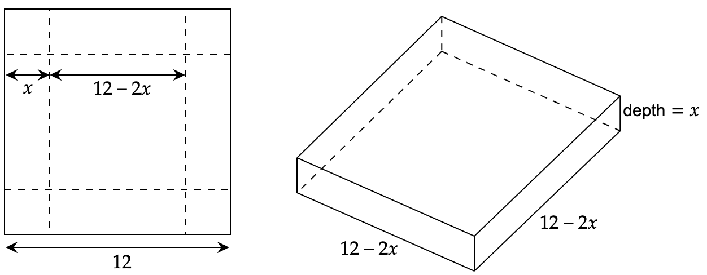
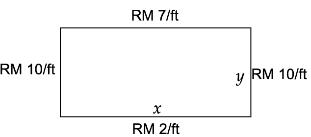

# Tutorial 2: Functions & Derivatives

---
[Tutorial PDF]({{ site.url }}/pdf/tutorial/tutorial2.pdf){: .btn .btn-purple }
[Solution PDF]({{ site.url }}/pdf/solution/tutorial2.pdf){: .btn .btn-green }

[Solution Slides]({{ site.url }}/pdf/slides/tutorial2.pdf){: .btn .btn-outline }
[Class Whiteboard]({{ site.url }}/pdf/whiteboard/tutorial2.pdf){: .btn .btn-outline }
[Class Recording](){: .btn .btn-outline }

[Solving using MATLAB]({{ site.url }}/matlab2){: .btn .btn-outline }
[Solving using Python]({{ site.url }}/python2){: .btn .btn-outline }

---

## Q1: Find $$y'$$ for $$(x-y)^2=x+y-1$$ by using implicit differentiation.
---

### Solution

$$\begin{aligned}
\mathcal{D}(x-y)^2&=\mathcal{D}(x+y-1) \\
\mathcal{D}(x-y)^2&=\mathcal{D}(x)+\mathcal{D}(y)-\mathcal{D}(1) \\
2(x-y)\mathcal{D}(x-y)&=1+y' \\
2(x-y)(1-y')&=1+y' \\
2(x-y)-2(x-y)y'&=1+y' \\
-2(x-y)y'-y'&=1-2(x-y) \\
y'[-2(x-y)-1]&=1-2(x-y) \\
y'&=\frac{1-2(x-y)}{-2(x-y)-1} \\
y'&=\boldsymbol{\frac{2y-2x+1}{2y-2x-1}}
\end{aligned}$$

---
## Q2: Implicit differentiation to find an equation of the tangent line to the curve $$5x^2+10xy^2+5y=20$$ at point $$(2,2)$$.
---

### Solution

$$\begin{aligned}
\mathcal{D}(5x^2+10xy^2+5y)&=\mathcal{D}(20) \\
10x+10x(2y\cdot y')+y^2\cdot10+5y'&=0 \\
10x+20xy\cdot y'+10y^2+5y'&=0 \\
(20xy+5)y'&=-10y^2-10x \\
y'&=\frac{-10y^2-10x}{20xy+5}
\end{aligned}$$

At point $$(2,2)$$, $$y'=\frac{-10(2)^2-10(2)}{20(2)(2)+5}=-\frac{12}{17}$$

Knowing $$y=mx+c$$, 

$$2=-\frac{12}{17}(2)+c \rightarrow c=\frac{58}{17}$$

$$\therefore \text{Tangent Line: }\boldsymbol{y=-\frac{12}{17}x+\frac{58}{17}}$$

---
## Q3: $$y\cos{x}=1+\sin{(xy)}$$. Find $$\frac{dy}{dx}$$ by implicit differentiation.
---

### Solution

$$\begin{aligned}
y\cos{x}&=1+\sin{(xy)} \\
y(-\sin{x})+(\cos{x})y'&=\cos{(xy)}\cdot(xy'+y) \\
-y\sin{x}+y'\cos{x}&=(xy'+y)\cos{(xy)} \\
y'&=\boldsymbol{\frac{y\cos{(xy)}+y\sin{x}}{\cos{x}-x\cos{xy}}}
\end{aligned}$$

---
## Q4: Find $$\frac{dy}{dx}$$ by implicit differentiation $$4\cos{x}\sin{y}=1$$.
---

### Solution

$$\begin{aligned}
4\cos{x}\sin{y}&=1\\
(4\cos{x})\cdot(\cos{y})\cdot y'+(\sin{y})\cdot(-4\sin{x})&=0 \\
y'&=\frac{4\sin{x}\sin{y}}{4\cos{x}\cos{y}} \\
&= \boldsymbol{\tan{x}\tan{y}}
\end{aligned}$$

---
## Q5: An open box is to be made from cutting a square from each corner of a 12 in by 12 in piece of metal and then folding up the sides. What size square should be cut from each corner to produce a box of maximum volume?
---

### Solution

The volume is to be maximized, $$V=lwh=x(12-2x)(12-2x)=4x^3-48x^2+144x$$.

$$\begin{aligned}
V(x)&=4x^3-48x^2+144x \\
V'(x)&=12x^2-96x+144
\end{aligned}$$

The critical point can be calculate such that, $$V'(x)=0$$.

$$\begin{aligned}
0&=12x^2-96x+144 \\
0&=12(x^2-8x+12) \\
0&=12(x-2)(x-6) \\
\therefore x&=2,6
\end{aligned}$$

When $$x=2$$, $$V(2)=128$$.

When $$x=6$$, $$V(6)=0$$.

Thus, when $$x=2$$, the maximum volume is 128 in$$^3$$. To prove that, using second derivation,

$$V''(x)=24x-96$$.

When $$x=2$$, $$V''(2) < 0 $$ (Maximum Volume)

When $$x=6$$, $$V''(6) > 0 $$ (Minimum Volume)

Thus, $$x=2$$.

---
## Q6: We are going to fence in a rectangular field. If we look at the field from above the cost of the vertical sides are RM 10/ft, the cost of the bottom is RM2/ft and the cost of the top is RM 7 /ft. If we have RM 700 determind the dimensions of the field that will maximize the enclosed area. 
---

### Solution

We have RM 700, therefore $$700=10y+2x+10y+7x=20y+9x$$.

In terms of $$y$$, $$y=35-\frac{9}{20}x$$. 

Since $$A=xy$$, plugging in yields $$A(x)=x\left(35-\frac{9}{20}x\right)$$.

The critical point can be calculate such that, $$V'(x)=0$$.

$$\begin{aligned}
A'(x) &= 35-\frac{9}{10}(x) \\
0&=35-\frac{9}{10}(x) \\
\therefore x&=\frac{350}{9}
\end{aligned}$$

The second derivation,

$$A''(x)=-\frac{9}{10}$$.

This means that the second derivative always negative and so $$A(x)$$ will always be concave down and so the single critical point. Therefore the value obtained in $$A'(x)$$ must be the value that yield maximum area.

Substituting $$x=\frac{350}{9}$$ into the equation of $$y$$, $$y=35-\frac{9}{20}\left(\frac{350}{9}\right)=\frac{35}{2}$$.

Thus, the final dimension is, $$\boldsymbol{x=\frac{350}{9}, y=\frac{35}{2}}$$.
