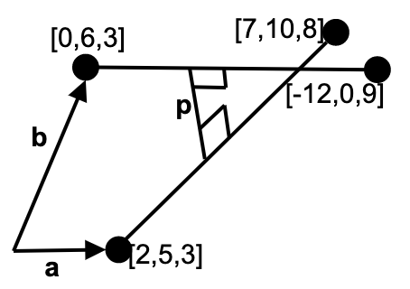

# Tutorial 5: Vector Algebra II

---
[Tutorial PDF]({{ site.url }}/pdf/tutorial/tutorial5.pdf){: .btn .btn-purple }
[Solution PDF]({{ site.url }}/pdf/solution/tutorial5.pdf){: .btn .btn-green }

[Class Recording](https://drive.google.com/file/d/1DzNQNIAPAm13EvYLCyplDjYbmM66KBSx/view?usp=sharing){: .btn .btn-outline }
[Class Whiteboard]({{ site.url }}/pdf/whiteboard/tutorial5.png){: .btn .btn-outline }

---

## Q1: Two long straight pipes are specified using Cartesian coordinates as follow:

## Pipe A: diameter 0.8; axis through points $$(2,5,3)$$ and $$(7,10,8)$$.

## Pipe B: diameter 1.0; axis through points $$(0,6,3)$$ and $$(-12,0,9)$$.

## Do the pipes need re-aligning to avoid intersection?

---
### Solution

Pipe A and B have axes:

$$\begin{gather*}
\mathbf{r}_{A} =[ 2,5,3] +\lambda '[ 5,5,5] =[ 2,5,3] +\lambda \frac{[ 1,1,1]}{\sqrt{3}}]\\
\mathbf{r}_{B} =[ 0,6,3] +\mu '[ -12,-6,6] =[ 0,6,3] +\mu \frac{[ -2,-1,1]}{\sqrt{6}}
\end{gather*}$$

(Non-unit) perpendicular to both axes is 

$$\mathbf{p} =\begin{vmatrix}
\hat{\mathbf{i}} & \mathbf{\hat{j}} & \mathbf{\hat{k}}\\
1 & 1 & 1\\
-2 & -1 & 1
\end{vmatrix} =[ 2,-3,1]$$

The length of the mutual perpendicular is mod

$$(\mathbf{a} -\mathbf{b}) \cdot \frac{[ 2,-3,1]}{\sqrt{14}} =[ 2,-1,0] \cdot \frac{[ 2,-3,1]}{\sqrt{14}} =1.87$$

Sum of the radii of the pipes is $$0.4+0.5=0.9$$. Hence, the pipes do not intersect.

---

## Q2: Find the distance from $$P=\ ( −3,7,4)$$ to the line $$l$$ with vector equation $$\mathbf{r} =\begin{pmatrix} 2\\-2\\-3\end{pmatrix} +\lambda \begin{pmatrix} 4\\-5\\3 \end{pmatrix}$$.

---
### Solution

$$\mathbf{a} =\begin{pmatrix}
2\\
-2\\
-3
\end{pmatrix}$$, $$A=( 2,-2,3)$$ and $$\mathbf{u} =\begin{pmatrix}
4\\
-5\\
3
\end{pmatrix}$$.

$$\overrightarrow{AP}$$ represents $$\mathbf{v} =\mathbf{p} -\mathbf{a} =\begin{pmatrix}
-3\\
7\\
4
\end{pmatrix} -\begin{pmatrix}
2\\
-2\\
-3
\end{pmatrix} =\begin{pmatrix}
-5\\
9\\
7
\end{pmatrix}$$

$$\mathbf{u} \times \mathbf{v} =\begin{vmatrix}
-5 & 3\\
9 & 7
\end{vmatrix}\mathbf{i} -\begin{vmatrix}
4 & 3\\
-5 & 7
\end{vmatrix}\mathbf{j} +\begin{vmatrix}
4 & -5\\
-5 & 9
\end{vmatrix}\mathbf{k} =\begin{pmatrix}
-62\\
-43\\
11
\end{pmatrix}$$

Thus, $$\vert \mathbf{u} \times \mathbf{v}\vert =\sqrt{( -62)^{2} +( -43)^{2} +11^{2}} =3\sqrt{646}$$ and $$\vert \mathbf{u}\vert =\sqrt{4^{2} +( -5)^{2} +3^{2}} =5\sqrt{2}$$.

The distance is,

$$\frac{\vert\mathbf{u} \times \mathbf{v}\vert}{\vert \mathbf{u}\vert } =\frac{3\sqrt{646}}{5\sqrt{2}} =\frac{3\sqrt{323}}{5}$$

Note that we have $$\mathbf{v} \times \mathbf{u} =(\mathbf{p} -\mathbf{a}) \times \mathbf{u} =-(\mathbf{u} \times \mathbf{v})$$ and so $$ \vert \mathbf{v} \times \mathbf{u}\vert =\vert (\mathbf{p} -\mathbf{a}) \times \mathbf{u}\vert =\vert \mathbf{u} \times \mathbf{v}\vert $$.

---

## Q3: Calculate the distance between the lines $$l$$ and $$m$$ having vector equations $$\mathbf{r} =\mathbf{a} +\lambda \mathbf{u}$$ and $$\mathbf{r} =\mathbf{b} +\mu \mathbf{v}$$ respectively, where $$\mathbf{a} =\begin{pmatrix}0\\4\\-1\end{pmatrix} ,\quad \mathbf{u} =\begin{pmatrix}1\\-3\\-2\end{pmatrix} ,\quad \mathbf{b} =\begin{pmatrix}2\\-1\\0\end{pmatrix} \ \quad \text{and} \quad \mathbf{v} =\begin{pmatrix}-3\\1\\2\end{pmatrix}$$

---
### Solution

$$\mathbf{b} -\mathbf{a} =2\mathbf{i} -5\mathbf{j} +k$$

$$\mathbf{u} \times \mathbf{v} =\begin{pmatrix}
1\\
-3\\
-2
\end{pmatrix} \times \begin{pmatrix}
-3\\
1\\
2
\end{pmatrix} =\begin{vmatrix}
-3 & 1\\
-2 & 2
\end{vmatrix}\mathbf{i} -\begin{vmatrix}
1 & -3\\
-2 & 2
\end{vmatrix}\mathbf{j} +\begin{vmatrix}
1 & -3\\
-3 & 1
\end{vmatrix}\mathbf{k} =\begin{pmatrix}
-4\\
4\\
-8
\end{pmatrix}$$

Thus, we get $$(\mathbf{b} -\mathbf{a}) \cdot (\mathbf{u} \times \mathbf{v}) =-8-20-8=-36$$ and 

$$\vert \mathbf{u} \times \mathbf{v}\vert =\sqrt{( -4)^{2} +4^{2} +( -8)^{2}} =4\sqrt{6}$$

The distance from $$l$$ to $$m$$ is

$$\frac{\vert \mathbf{( b - a) \cdot ( u} \times \mathbf{v})\vert }{\vert \mathbf{u} \times \mathbf{v}\vert } =\frac{\vert -36\vert }{\sqrt{96}} =\frac{36}{4\sqrt{6}} =\frac{9}{\sqrt{6}}$$

---

## Q4: Find the Cartesian equation of plane contains the point $$( 1,2,-1)$$ and perpendicular to the intersecting line of the planes and $$2x+y+z=2$$ and $$x+2y+z=3$$.

---
### Solution

The intersecting line has vector that is parallel to both planes, which is the cross product of their respectively normal vector,

$$\underset{\sim }{n}_{1} \times \underset{\sim }{n}_{2} =\begin{vmatrix}
\underset{\sim }{i} & \underset{\sim }{j} & \underset{\sim }{k}\\
2 & 1 & 1\\
1 & 2 & 1
\end{vmatrix} =\underset{\sim }{i}( 1-2) -\underset{\sim }{j}( 2-1) +\underset{\sim }{k}( 4-1) =\langle -1,-1,3\rangle$$

The Cartesian equation of plane that perpendicular to the intersecting line has the notmal vector that is parallel to the vector $$\underset{\sim }{n}_{1} \times \underset{\sim }{n}_{2} =\langle -1,-1,3\rangle$$

Therefore, Cartesian equation of plane is $$-x-y+3z=k$$. Substitute the point $$( 1,2,-1)$$ which is located on the plane to find $$k$$, 

$$k=-1-2+3( -1) =-6$$

$$\therefore -x-y+3z=-6$$$

---

## Q5: Find the Cartesian equation of plane contains the line $$L_{1} : \mathbf{r}_1 =\mathbf{a} +t\mathbf{u} =\langle 1,-3,4\rangle +\langle 2,1,1\rangle \mathbf{t}$$ and parallel to the line $$L_2 :\mathbf{b} +s\mathbf{v} =\langle 0,0,0\rangle +\langle 1,2,3\rangle \mathbf{s}$$. From the result, can you proof that the plane is parallel to line $$L_{2}$$?

---
### Solution

The normal vector of the plane that containing two lines is

$$\underset{\sim }{u} \times \underset{\sim }{v} =\begin{vmatrix}
\underset{\sim }{i} & \underset{\sim }{j} & \underset{\sim }{k}\\
2 & 1 & 1\\
1 & 2 & 3
\end{vmatrix} =\underset{\sim }{i}( 3-2) -\underset{\sim }{j}( 6-1) +\underset{\sim }{k}( 4-1) =\langle 1,-5,3\rangle$$

Therefore, Cartesian equation of plane is $$-x-5y+3z=k$$. Substitute point $$A( 1,-3,4)$$ to find $$k$$, 

$$k=1-5( -3) +3( 4) =28$$

$$\therefore x-5y+3z=28$$

Note: Point $$B( 0,0,0)$$ can't be used to find $$k$$ because we don't know if it is located on the plane.

To prove that the plane is parallel to line $$L_{2}$$, use dot product where dot product of vector normal and parallel to the plane is equal to zero.

Vector normal to the plane is $$\langle 1,-5,3\rangle$$, Vector parallel to the plane is $$\langle 1,2,3\rangle$$. 

Since $$\langle 1,-5,3\rangle \cdot \langle 1,2,3\rangle =0$$, thus the plane is parallel to line $$L_{2}$$.

---

## Q6: Find the Cartesian equation of plane contains the line $$L_{1} :\ \mathbf{r}_1 =\mathbf{a} +t\mathbf{u} =\langle -2,3,4\rangle +\langle 1,2,-1\rangle \mathbf{t}$$ and line $$L_2 :\mathbf{b} +s\mathbf{v} =\langle 3,4,0\rangle +\langle -1,-21\rangle \mathbf{s}$$.

---
### Solution

The plane consists of line $$L_{1}$$ and $$L_{2}$$, therefore point $$A( -2,3,4)$$ and $$B( 3,4,0)$$ are located on the plane.

Therefore, $$\overrightarrow{AB} =\overrightarrow{OB} -\overrightarrow{OA} =\langle 3,4,0\rangle -\langle -2,3,4\rangle =\langle 5,1,-4\rangle$$ is one of the line that is parallel to the plane. (Note that a plane is formed by infinite line in various direction, thus there is more than one line parallel to it)

Since the plane contains line $$L_{1}$$ and $$L_{2}$$, thus the plane is parallel to both of them. From the vector equation of line, the plane is parallel $$\underset{\sim }{u} =\langle 1,2,-1\rangle$$ and $$\underset{\sim }{v} =\langle -1,-2,1\rangle$$ respectively. Note that these two lines are parallel to each other. Thus, they lies in the same plane. Use either one of them to find the plane equation. 

Use cross product to find vector normal to the plane,

$$\overrightarrow{AB} \times \underset{\sim }{u} =\begin{vmatrix}
\underset{\sim }{i} & \underset{\sim }{j} & \underset{\sim }{k}\\
5 & 1 & -4\\
1 & 2 & -1
\end{vmatrix} =\underset{\sim }{i}( -1+8) -\underset{\sim }{j}( -5+4) +\underset{\sim }{k}( 10-1) =\langle 7,1,9\rangle$$

Therefore, Cartesian equation is $$7x+y+9z=k$$.

Substitue either $$A( -2,3,4)$$ or $$B( 3,4,0)$$ to get $$k$,

$$k=7( -3) +3+9( 4) =25$$

$$\mathbf{\therefore 7x+y+9z=25}$$

---

## Q7: Find the unit vectors that are perpendicular to the vectors $$\underset{\sim }{a}$$ and $$\underset{\sim }{b}$$ as following

## (i) $$\underset{\sim }{a} =\langle 2,4,5\rangle$$, $$\underset{\sim }{b} =\langle 1,2,-2\rangle$$

## (ii) $$\underset{\sim }{a} =\langle 2,4,-4\rangle$$, $$\underset{\sim }{b} =\langle 1,2,-2\rangle$$

---

### Solution

Vector perpendicular to both vector $$\underset{\sim }{a}$$ and $$\underset{\sim }{b}$$ is $$\underset{\sim }{a} \times \underset{\sim }{b}$$. 

Unit vector of $$\underset{\sim }{a} \times \underset{\sim }{b}$$ is $$\underset{\sim }{a} \times \underset{\sim }{b} =\frac{\underset{\sim }{a} \times \underset{\sim }{b}}{\left\vert \underset{\sim }{a} \times \underset{\sim }{b}\right\vert }$$.

#### <u> Question (i) </u>

$$\underset{\sim }{a} \times \underset{\sim }{b} =\begin{vmatrix}
\underset{\sim }{i} & \underset{\sim }{j} & \underset{\sim }{k}\\
2 & 4 & 5\\
1 & 2 & -2
\end{vmatrix} =\underset{\sim }{i}( -8+10) -\underset{\sim }{j}( -4+5) +\underset{\sim }{k}( 4-4) =\langle -2,-1,0\rangle$$

$$\underset{\sim }{a} \times \underset{\sim }{b} =\frac{\underset{\sim }{a} \times \underset{\sim }{b}}{\left\vert \underset{\sim }{a} \times \underset{\sim }{b}\right\vert } =\frac{\langle -2,-1,0\rangle }{\sqrt{( -2)^{2} +( -1)^{2}}} =\langle \frac{-2}{\sqrt{5}} ,\frac{-1}{\sqrt{5}} ,0\rangle$$

The unit vector is **exist** in this case.

#### <u> Question (ii) </u>

$$\underset{\sim }{a} \times \underset{\sim }{b} =\begin{vmatrix}
\underset{\sim }{i} & \underset{\sim }{j} & \underset{\sim }{k}\\
2 & 4 & 4\\
1 & 2 & -2
\end{vmatrix} =\underset{\sim }{i}( -8+8) -\underset{\sim }{j}( -4+4) +\underset{\sim }{k}( 4-4) =\langle 0,0,0\rangle$$

$$\underset{\sim }{a} \times \underset{\sim }{b} =\frac{\underset{\sim }{a} \times \underset{\sim }{b}}{\left\vert \underset{\sim }{a} \times \underset{\sim }{b}\right\vert } =\frac{\langle 0,0,0\rangle }{0}$$

The unit vector **does not exist** in this case.

---

## Q8: Let $$\underset{\sim }{a} =\langle 1,-2,-3\rangle$$, $$\underset{\sim }{b} =\langle 2,1,-1\rangle$$ and $$\underset{\sim }{c} =\langle 1,3,-2\rangle$$. Find

## (i) $$\underset{\sim }{a} \cdot \underset{\sim }{b}\left(\underset{\sim }{a} \times \underset{\sim }{b}\right)$$

## (ii) $$\underset{\sim }{a} +\underset{\sim }{b} \times \underset{\sim }{c}$$

---
### Solution

#### <u> Question (i) </u>

$$\begin{aligned}
\underset{\sim }{a} \cdot \underset{\sim }{b}\left(\underset{\sim }{a} \times \underset{\sim }{b}\right) & =\langle 1,-2,-3\rangle \cdot \langle 2,1,-1\rangle ( \langle 1,-2,-3\rangle \times \langle 2,1,-1)\\
 & =( 2-2+3)\left(\begin{vmatrix}
\underset{\sim }{i} & \underset{\sim }{j} & \underset{\sim }{k}\\
1 & -2 & -3\\
2 & 1 & -1
\end{vmatrix}\right)\\
 & =3\left[\underset{\sim }{i}( 2+3) -\underset{\sim }{j}( -1+6) +\underset{\sim }{k}( 1+4)\right]\\
 & =3\left( 5\underset{\sim }{i} -5\underset{\sim }{j} +5\underset{\sim }{k}\right)\\
 & =\mathbf{15\underset{\sim }{i} -15\underset{\sim }{j} +15\underset{\sim }{k}}
\end{aligned}$$

#### <u> Question (ii) </u>

$$\begin{aligned}
\underset{\sim }{a} +\underset{\sim }{b} \times \underset{\sim }{c} & =( \langle 1,-2,-3\rangle +\langle 2,1,-1\rangle ) \times \langle 1,3,-2\rangle \\
 & =( \langle 3,-1,-4\rangle ) \times \langle 1,3,-2\rangle \\
 & =\begin{vmatrix}
\underset{\sim }{i} & \underset{\sim }{j} & \underset{\sim }{k}\\
3 & -1 & -4\\
1 & 3 & -2
\end{vmatrix}\\
 & =14\underset{\sim }{i} +2\underset{\sim }{j} +10\underset{\sim }{k}
\end{aligned}$$