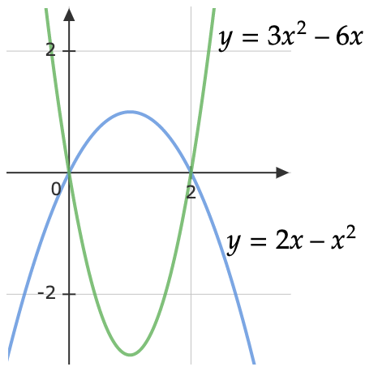
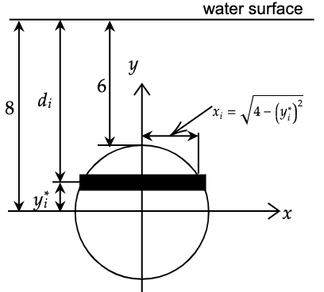

# Tutorial 9: Engineering Applications of Integral

---
[Tutorial PDF]({{ site.url }}/pdf/tutorial/tutorial9.pdf){: .btn .btn-purple }

[Class Recording](https://drive.google.com/file/d/12pM4YyYUDuMUtpxPAkWwN8tA5OImRGgG/view?usp=sharing){: .btn .btn-outline }

---

## Q1: Find the arc length $$L$$ of the curve $$y=x^{\frac{3}{2}}$$ from $$x=0$$ to $$x=5$$.

---
### Solution

$$ y'  =\frac{3}{2} x^{\frac{1}{2}} =\frac{3}{2}\sqrt{x}$$

$$\begin{aligned}
L & =\int _{0}^{5}\sqrt{1+( y')^{2}} \ dx\\
 & =\int _{0}^{5}\sqrt{1+\left(\frac{3}{2}\sqrt{x}\right)^{2}} \ dx\\
 & =\int _{0}^{5}\sqrt{1+\frac{9}{4} x} \ dx\\
 & =\int _{0}^{5}\left( 1+\frac{9}{4} x\right)^{\frac{1}{2}} \ dx\\
 & =\left. \frac{\left( 1+\frac{9}{4} x\right)^{\frac{3}{2}}}{\left(\frac{3}{2}\right)\left(\frac{9}{4}\right)}\right| _{0}^{5}\\
 & =\frac{\left( 1+\frac{9}{4}( 5)\right)^{\frac{3}{2}}}{\frac{27}{8}} -\frac{\left( 1+\frac{9}{4}( 0)\right)^{\frac{3}{2}}}{\frac{27}{8}}\\
 & =\mathbf{\frac{335}{27}}
\end{aligned}$$

---

## Q2: Find the area bounded by the parabola $$x=8+2y-y^{2}$$, the y-axis, and the lines $$y=-1$$ and $$y=3$$.

---
### Solution

$$\begin{aligned}
x & =8+2y-y^{2}\\
 & =-\left( y^{2} -2y-8\right)\\
 & =-\left(( y-1)^{2} -9\right)\\
 & =( 4-y)( 2+y)
\end{aligned}$$

$$\therefore$$ The vortex of the parabola is $$(9,1)$$ and cuts the y-axis at $$y=-4$$, $$y=-2$$.

Area bounded by the parabola:

$$\begin{aligned}
\int _{-1}^{3}\left( 8+2y-y^{2}\right) \ dy & =\left. 8y+y^{2} -\frac{1}{3} y^{3}\right| _{-1}^{3}\\
 & =\left( 8( 3) +3^{2} -\frac{1}{3}( 3)^{3}\right) -\left( 8( -1) +( -1)^{2} -\frac{1}{3}( -1)^{3}\right)\\
 & =\mathbf{\frac{92}{3}}
\end{aligned}$$

---

## Q3: Find the arc length of the catenary $$y=\frac{a}{2}\left( e^{\frac{x}{a}} +e^{-\frac{x}{a}}\right)$$ from $$x=0$$ to $$x=a$$.

---
### Solution

$$\begin{aligned}
y' & =\frac{a}{2}\left(\frac{1}{a} e^{\frac{x}{a}} -\frac{1}{a} e^{-\frac{x}{a}}\right) +0\left( e^{\frac{x}{a}} +e^{-\frac{x}{a}}\right)\\
 & =\frac{a}{2}\left(\frac{1}{a}\right)\left( e^{\frac{x}{a}} -e^{-\frac{x}{a}}\right)\\
 & =\frac{1}{2}\left( e^{\frac{x}{a}} -e^{-\frac{x}{a}}\right)
\end{aligned}$$

Arc length:

$$\begin{aligned}
L & =\int _{0}^{a}\sqrt{1+( y')^{2}} \ dx\\
 & =\int _{0}^{a}\sqrt{1+\left[\frac{1}{2}\left( e^{\frac{x}{a}} -e^{-\frac{x}{a}}\right)\right]^{2}} dx\\
 & =\int _{0}^{a}\sqrt{1+\frac{1}{4}\left( e^{\frac{2x}{a}} -2e^{0} +e^{-\frac{2x}{a}}\right)} dx\\
 & =\int _{0}^{a}\sqrt{1+\frac{1}{4} e^{\frac{2x}{a}} -\frac{1}{2} +\frac{1}{4} e^{-\frac{2x}{a}}} dx\\
 & =\int _{0}^{a}\sqrt{\frac{1}{4} e^{\frac{2x}{a}} +\frac{1}{2} +\frac{1}{4} e^{-\frac{2x}{a}}} dx\\
 & =\int _{0}^{a}\sqrt{\frac{1}{4}\left[ e^{\frac{2x}{a}} +2+ e^{-\frac{2x}{a}}\right]} dx\\
 & =\int _{0}^{a}\sqrt{\frac{1}{4}\left( e^{\frac{x}{a}} +e^{-\frac{x}{a}}\right)^{2}} dx\\
 & =\int _{0}^{a}\frac{1}{2}\left( e^{\frac{x}{a}} +e^{-\frac{x}{a}}\right) \ dx\\
 & =\frac{1}{2}\int _{0}^{a}\left( e^{\frac{x}{a}} +e^{-\frac{x}{a}}\right) \ dx\\
 & =\frac{1}{2}\left[\left. \frac{e^{\frac{x}{a}}}{\frac{1}{a}} -\frac{e^{-\frac{x}{a}}}{\frac{1}{a}}\right| _{0}^{a}\right]\\
 & =\frac{1}{2} \div a\left[ e^{1} +e^{-1} -1+1\right]\\
 & =\mathbf{\frac{a}{2}\left[ e-e^{-1}\right]}
\end{aligned}$$

---

## Q4: Find the centroid of the plane area bounded by the parabolas $$y=2x−x^{2}$$ and $$y=3x^{2}-6x$$.

---
### Solution

$$\begin{aligned}
A & =\int \int\limits _{R} dA\\
 & =\int _{0}^{2}\int _{3x^{2} -6x}^{2x-x^{2}} dydx\\
 & =\int _{0}^{2}\left[ 2x-x^{2} -3x^{2} +6x\right] dx\\
 & =\int _{0}^{2}\left[ -4x^{2} +8x\right] dx\\
 & =\left. \frac{-4x^{3}}{3} +4x^{2}\right| _{0}^{2}\\
 & =\frac{-4( 2)^{3}}{3} +4( 2)^{2}\\
 & =\mathbf{\frac{16}{3}}
\end{aligned}$$

$$\begin{aligned}
M_{y} & =\int \int\limits _{R} x\ dA\\
 & =\int _{0}^{2}\int _{3x^{2} -6x}^{2x-x^{2}} x\ dydx\\
 & =\int _{0}^{2} x\left( 2x-x^{2} -3x^{2} +6x\right) \ dx\\
 & =\int _{0}^{2}\left[ -4x^{3} +8x^{2}\right] dx\\
 & =\left. -x^{4} +\frac{8}{3} x^{3}\right| _{0}^{2}\\
 & =-2^{4} +\frac{8}{3}( 2)^{3}\\
 & =\mathbf{\frac{16}{3}}
\end{aligned}$$

$$\begin{aligned}
M_{x} & =\int \int\limits _{R} y\ dA\\
 & =\int _{0}^{2}\int _{3x^{2} -6x}^{2x-x^{2}} y\ dydx\\
 & =\frac{1}{2}\int _{0}^{2}\left[\left( 2x-x^{2}\right)^{2} -\left( 3x^{2} -6x\right)^{2}\right] dx\\
 & =\frac{1}{2}\int _{0}^{2}\left[ 4x^{2} -4x^{3} +x^{4} -9x^{4} +36x^{3} -36x^{2}\right] dx\\
 & =\frac{1}{2}\int _{0}^{2}\left[ -8x^{4} +32x^{3} -32x^{2}\right] dx\\
 & =\frac{1}{2}\left[\left. -\frac{8}{5} x^{5} +8x^{4} -\frac{32}{3} x^{3}\right| _{0}^{2}\right]\\
 & =\frac{1}{2}\left[ -\frac{8}{5}( 2)^{5} +8( 2)^{4} -\frac{32}{3}( 2)^{3}\right]\\
 & =-\frac{64}{15}
\end{aligned}$$

Hence, $$x=\frac{M_{y}}{A} =\frac{\frac{16}{3}}{\frac{16}{3}} =1$$, $$y=\frac{M_{x}}{A} =\frac{-\frac{64}{15}}{\frac{16}{3}} =-\frac{4}{5}$$. Thus, **the centroid is** $$\left( 1,-\frac{4}{5}\right)$$.

---

## Q5: Find the hydrostatic force on a circular plate of radius 2 that is submerged 6 meters in the water.

---
### Solution

Assume that the top of the circular plate is 6 meters under the water. 

Setting up the axis system such that the origin of the axis is at the center of the plate. 

Finally, split up the plate into $$n$$ horizontal strips each of width $$\Delta y$$. Choosing a point $$y_{i}^{*}$$ from each strip. Assume that the strips are rectangular.

The depth below the water surface of each strip is,

$$d_{i} =8-y_{i}^{*}$$

and that in turn gives us the pressure on the strip,

$$P_{i} =\rho gd_{i} =9810\left( 8-y_{i}^{*}\right)$$

The area of each strip is,

$$A_{i} =2\sqrt{4-\left( y_{i}^{*}\right)^{2}} \ \ \Delta y$$

The hydrostatic force on each strip is,

$$F_{i} =P_{i} A_{i} =9810\left( 8-y_{i}^{*}\right)( 2)\sqrt{4-\left( y_{i}^{*}\right)^{2}} \ \ \Delta y$$

The total force on the plate is,

$$\begin{aligned}
F & =\lim\limits _{n\rightarrow \infty }\sum\limits _{i=1}^{n} 19620\left( 8-y_{i}^{*}\right)\sqrt{4-\left( y_{i}^{*}\right)^{2}} \ \ \Delta y\\
 & =19620\int _{\ -2}^{\ 2}( 8-y)\sqrt{4-y^{2}} \ dy\\
 & =19620\int _{\ -2}^{\ 2} 8\sqrt{4-y^{2}} \ dy-19620\int _{\ -2}^{\ 2} y\sqrt{4-y^{2}} \ dy
\end{aligned}$$

The first integral requires the trig substitution $$y=2\sin \theta$$ and the second integral needs the substitution $$v=4-y^{2}$$.

$$\begin{align*}
F & =627840\int _{\ -\pi /2\ }^{\ \pi /2\ }\cos^{2} \theta \ d\theta +9810\int _{\ 0}^{\ 0}\sqrt{v} \ dv\\
 & =313920\int _{\ -\pi /2\ }^{\ \pi /2\ } 1+\cos( 2\theta ) \ d\theta +0\\
 & =313920\left. \left( \theta +\frac{1}{2}\sin( 2\theta )\right)\right| _{-\pi /2}^{\pi /2}\\
 & =\mathbf{313920\pi }
\end{align*}$$